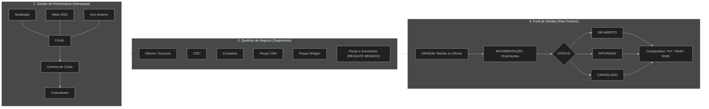

# Diagrama de Estrutura: BI Performance Inova

Este diagrama representa a arquitetura de dados e o fluxo de processos extraídos do quadro branco, com a hierarquia corrigida.

## Resumo dos Fluxos:
1.  **Faturamento:** Flui de cima para baixo (Filial para Categorias de Centro de Custo, e então Consultores).
2.  **Orçamentação (Funil):** Flui da **esquerda para a direita** (Origem ➔ Status ➔ Comparativo).
3.  **Resgate:** A categoria "Peças e Acessórios" atua como um capturador de transações sem centro de custo definido.
