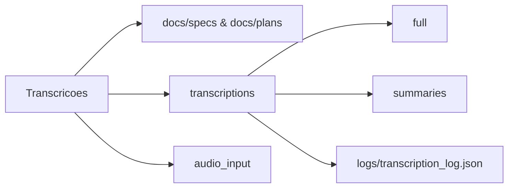

# 📐 Spec: Pipeline de Transcrição Industrial (v3)

**Status:** Aprovado para Implementação  
**Governança:** Framework Stout | Antigravity Standard  

---

## 1. Objetivo (Business Purpose)
Formalizar a infraestrutura técnica para um pipeline de transcrição de alta fidelidade que seja:
- **Auditável:** Cada arquivo processado gera um rastro digital (Hash + JSON Log).
- **Eficiente:** Otimização de espaço via FLAC e prevenção de reprocessamento.
- **Resiliente:** Normalização de áudio para maximizar a precisão da IA.

---

## 2. Mapeamento de Dados (Data Flow)

> [!IMPORTANT]
> A soberania dos dados é mantida localmente em `/transcriptions/`. Nenhum dado sensível deve vazar para logs externos não-auditados.

| Origem | Processamento | Destino Final | Formato |
|:---|:---|:---|:---:|
| `audio_input/` | FFmpeg (16kHz Mono) | `transcriptions/full/` | .md / .pdf |
| `audio_input/` | Whisper -> Meeting Assistant | `transcriptions/summaries/` | .md |
| Metadata | Hash MD5 | `transcriptions/logs/` | .json |
| `audio_input/` | FFmpeg (FLAC) | `audio_input/` (Archive) | .flac |

---

## 3. Requisitos Técnicos (Engine Upgrade)

### 3.1. Inteligência de Lote (Batch Intelligence)
O motor deve iterar sobre a pasta de entrada e verificar o arquivo de log antes de iniciar a transcrição. Se o hash do arquivo coincidir com uma entrada de "sucesso", o arquivo deve ser ignorado.

### 3.2. Normalização de Sinal
Todo áudio deve ser pré-processado para:
- **Sample Rate:** 16.000 Hz.
- **Canais:** 1 (Mono).
- **Codec:** pcm_s16le.

### 3.3. Preservação de Mídia
O arquivo original (ex: .m4a, .mp3) deve ser convertido para **FLAC (Lossless)** após a geração do PDF. O original deve ser removido para otimização de storage.

---

## 4. Plano de Validação (Acceptance Criteria)

> [!CAUTION]
> Um arquivo só é considerado "Auditado" se passar nos três checks abaixo simultaneamente.

- **[ ] Validação Técnica:** Arquivos MD e PDF existem e possuem cabeçalho Metadata correto.
- **[ ] Validação de Paridade:** A discrepância entre a duração do áudio e o último timestamp da transcrição deve ser < 2 segundos.
- **[ ] Validação de Log:** O arquivo `transcription_log.json` deve conter o hash MD5 único e o status `success`.

---

## 5. Arquitetura de Pastas (Workspace)

---
*Referência: SPEC-TR-V3-2026 | Arquiteto: Antigravity AI*
