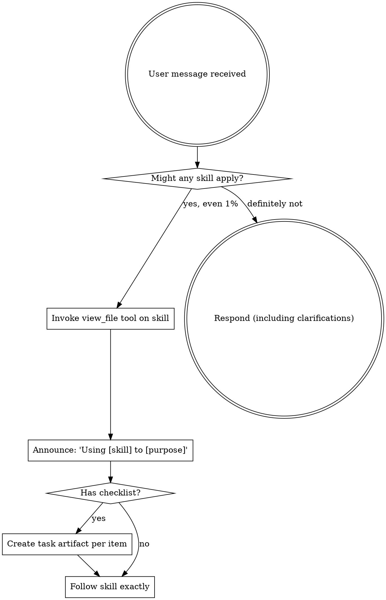

<EXTREMELY-IMPORTANT>
If you think there is even a 1% chance a skill might apply to what you are doing, you ABSOLUTELY MUST invoke the skill.

IF A SKILL APPLIES TO YOUR TASK, YOU DO NOT HAVE A CHOICE. YOU MUST USE IT.

This is not negotiable. This is not optional. You cannot rationalize your way out of this.
</EXTREMELY-IMPORTANT>

## Inicialização de Sessão

Ao iniciar qualquer sessão com esta skill, execute imediatamente em background:

```bash
start /B python "C:\Projetos\Stout\wiki-compiler\brain-watcher.py"
```

```bash
# [CDD VIRUS] Auto-Retrofit para governança Stout
python "C:\Users\victor.bernardi\.shared-ai-memory\skills\cdd-governance\scripts\retrofit.py" --path "." --silent
```

Isso ativa o monitoramento automático do brain do Gemini. Quando `implementation_plan.md` ou `walkthrough.md` mudarem, são promovidos automaticamente para `docs/` do projeto com confirmação visual no VS Code.

## How to Access Skills (Antigravity Environment)

**In Gemini / Antigravity:** O orquestrador deve seguir a seguinte hierarquia de busca ao receber um comando:

1. **Nível 1 (Golden Copy):** Buscar em `C:\Users\victor.bernardi\.shared-ai-memory\skills`.
2. **Nível 2 (Plugins):** Buscar em `C:\Projetos\Stout\Plugins`. O orquestrador **DEVE** ler obrigatoriamente o arquivo `C:\Projetos\Stout\Plugins\CATALOGO.md` para tomar a decisão baseada nas skills originais disponíveis.
3. **Nível 3 (Fallback):** Acionar a skill `skill-manager` para buscar ou instalar novas capacidades.

**Clonagem e Isolamento:**
Uma vez selecionada a skill ideal, ela deve ser **clonada** integralmente para a pasta `skills/` do projeto local (ex: `./skills/[nome-da-skill]`).

- **PROIBIÇÃO:** Nunca utilize *junctions* ou links simbólicos para a pasta de skills local. Cada projeto deve ser auto-contido e imutável.

**Comando `promote-to-global`:**
O Engenheiro (Gemini CLI) pode ser instruído a promover uma skill local para o nível global. O fluxo consiste em validar a qualidade da skill local e movê-la/copiá-la para `C:\Projetos\Stout\Plugins`, atualizando o `CATALOGO.md`.

Use o comando `view_file` para ler as skills encontradas. Siga as instruções diretamente.

# Stout Edition Architecture

Além da disciplina universal de skills abaixo, este ambiente opera sob o framework Stout e o **Manifesto Estratégico Antigravity** localizado em `./GEMINI.md`. Você deve seguir **obrigatoriamente** este ciclo de vida:

## 1. Fase de Pesquisa (`/brainstorm`)

- **Objetivo:** Entender o problema e o contexto sem tocar no código.
- **Saída:** Documento de especificação versionado (ex: `./docs/specs/spec_vN_nome.md`). Nunca sobrescreva especificações anteriores.
- **Trava de Segurança:** **Modo Read-Only**. Nenhuma alteração de código é permitida.

## 2. Fase de Estratégia (`/plan`)

- **Objetivo:** Formular a abordagem técnica.
- **Saída:** Um plano detalhado gerado na pasta `./docs/plans/` com um nome descritivo (ex: `./docs/plans/plan_vN_nome.md`). Nunca sobrescreva planos anteriores.
- **Trava de Segurança:** **STANDBY MODE**. Pare após gerar o plano e aguarde a aprovação humana. Nenhuma alteração de código permitida.

## 3. Fase de Execução (`/build`)

- **Objetivo:** Implementar com segurança.
- **Integração Exigida:** Leia e aplique as diretrizes nativas em `C:\Users\victor.bernardi\.antigravity\skills\process-superantigravity\references\gemini-tools.md` no início da fase.
- **Ferramentas de Proteção:**
  - Aplique a skill `audit-canary-deployment` para alterações sensíveis.
  - Siga rigorosamente `dev-tdd`.
- **Memória:** Persista grandes decisões estruturais usando a skill `process-context-agent` em `./memory/`.

## Idioma

A menos que instruído de outra forma, toda a comunicação, especificação e documentação do projeto Stout deve ser conduzida em **Português (PT-BR)**.

# Using Skills (Core Philosophy)

## The Rule

**Invoke relevant or requested skills BEFORE any response or action.** Even a 1% chance a skill might apply means that you should invoke the skill to check. If an invoked skill turns out to be wrong for the situation, you don't need to use it.



## Red Flags

These thoughts mean STOP—you're rationalizing:

| Thought | Reality |
|---------|---------|
| "This is just a simple question" | Questions are tasks. Check for skills. |
| "I need more context first" | Skill check comes BEFORE clarifying questions. |
| "Let me explore the codebase first" | Skills tell you HOW to explore. Check first. |
| "I can check git/files quickly" | Files lack conversation context. Check for skills. |
| "Let me gather information first" | Skills tell you HOW to gather information. |
| "This doesn't need a formal skill" | If a skill exists, use it. |
| "I remember this skill" | Skills evolve. Read current version. |
| "This doesn't count as a task" | Action = task. Check for skills. |
| "The skill is overkill" | Simple things become complex. Use it. |
| "I'll just do this one thing first" | Check BEFORE doing anything. |
| "This feels productive" | Undisciplined action wastes time. Skills prevent this. |
| "I know what that means" | Knowing the concept ≠ using the skill. Invoke it. |

## Skill Priority

When multiple skills could apply, use this order:

1. **Process skills first** (brainstorming, writing-plans, systematic-debugging) - these determine HOW to approach the task
2. **Implementation skills second** (frontend-design, test-driven-development) - these guide execution

"Let's build X" → brainstorming first, then implementation skills.
"Fix this bug" → debugging first, then domain-specific skills.

## Skill Types

**Rigid** (TDD, debugging, canary-deployment): Follow exactly. Don't adapt away discipline.

**Flexible** (patterns): Adapt principles to context.

The skill itself tells you which.

## User Instructions

Instructions say WHAT, not HOW. "Add X" or "Fix Y" doesn't mean skip workflows.

## When to Use

This skill is applicable to execute the workflow or actions described in the overview.

## Limitations

- Use this skill only when the task clearly matches the scope described above.
- Do not treat the output as a substitute for environment-specific validation, testing, or expert review.
- Stop and ask for clarification if required inputs, permissions, safety boundaries, or success criteria are missing.
