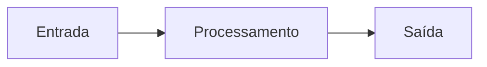

# 🎨 Antigravity: Guia de Estilo de Artefatos (Global)

Este documento define o padrão de qualidade estética e técnica para todos os artefatos, planos e especificações gerados no ecossistema Antigravity.

---

## 1. Princípios de Design Visual
Todo artefato deve ser "Wowed at first glance" (Impressionar à primeira vista).

- **Clareza Hierárquica:** Use títulos (H1, H2, H3) para segmentar responsabilidades.
- **Densidade de Informação:** Prefira tabelas para listas de tarefas ou status.
- **Visualização de Fluxo:** Sempre que houver lógica ou arquitetura, inclua um diagrama Mermaid.

---

## 2. Componentes Obrigatórios

### 2.1. Alertas de Governança (GitHub Style)
Use alertas para destacar informações críticas:

> [!IMPORTANT]
> Regras de negócio inegociáveis ou avisos de segurança/infraestrutura.

> [!TIP]
> Sugestões de performance, melhores práticas ou atalhos técnicos.

> [!CAUTION]
> Operações destrutivas ou riscos de perda de dados.

### 2.2. Diagramas Mermaid
Arquiteturas e fluxos devem ser visualizados:

### 2.3. Tabelas de Status
Para planos de ação, use o formato:

| ID | Task | Responsável | Status |
|:---|:---|:---|:---:|
| 01 | Nome da Task | IA/User | ⏳ Pendente |

---

## 3. Estrutura de Documentos (Templates)

### Especificações (Specs)
- **Objetivo:** Por que estamos fazendo isso?
- **Mapeamento de Dados:** De onde vem e para onde vai a informação?
- **Plano de Validação:** Como saberemos que funciona?

### Planos de Implementação (Plans)
- **Goal:** Resumo em uma frase.
- **Tech Stack:** Ferramentas envolvidas.
- **Bite-Sized Tasks:** Passos de 2 a 5 minutos.

---

## 4. Tom e Voz
- **Profissionalismo:** Linguagem técnica precisa.
- **Agencial:** Atuar como um "Diretor Criativo" ou "Arquiteto".
- **Idioma:** Português (PT-BR) por padrão, salvo instrução contrária.

---
*Referência: C:\Users\victor.bernardi\.shared-ai-memory\STYLE_GUIDE.md*
