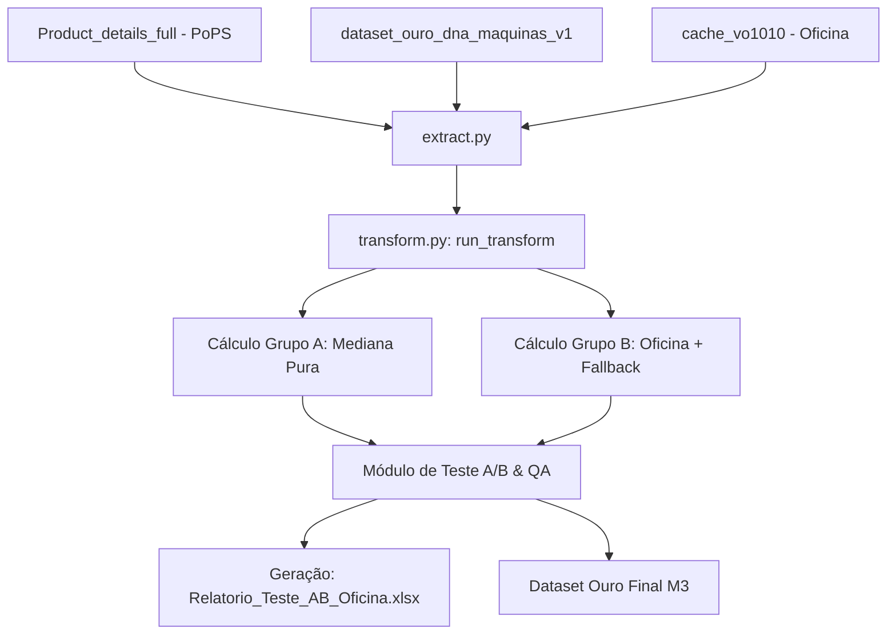

# 🧠 ESPECIFICAÇÃO TÉCNICA — IMPUTAÇÃO DE HORÍMETRO VIA OFICINA (M3)

## 1. OBJETIVO DO NEGÓCIO & PROPÓSITO
Esta especificação rege a implementação de uma lógica de imputação individual refinada para estimar o horômetro de máquinas John Deere e Wirtgen que possuem telemetria inativa ou ausente (JDLink desligado ou `Forecasted Machine Hours` inferior a 10, categorizadas como `ESTIMADO` no motor M3). 

A substituição de estimativas estatísticas gerais (mediana da safra/modelo) por taxas operacionais personalizadas baseadas no histórico real de passagens pela oficina (tabela `VO1010` do ERP Protheus via Fabric) visa aumentar significativamente a fidelidade do ciclo de vida das máquinas, garantindo projeções comerciais de potencial financeiro de reposição de peças com alto índice de acurácia no ecossistema Inova.

---

## 2. CRITÉRIOS DE ACEITAÇÃO (SOW / AC)

Para que esta funcionalidade seja aceita, ela deve atender aos seguintes critérios de aceitação refinados:

*   **AC-1 (Conectividade & Extração):** Consumir o histórico de atendimentos de oficina (`VO1010`) via cache do DNA ou conexão direta JDBC Fabric.
*   **AC-2 (Cálculo de OS Múltiplas):** Implementar taxa anualizada por variação temporal caso a máquina possua 2 ou mais passagens registradas na oficina separadas por no mínimo 30 dias.
*   **AC-3 (Cálculo de OS Única):** Implementar taxa anualizada calculada pela idade física do ativo caso a máquina possua exatamente 1 passagem registrada na oficina separada por no mínimo 30 dias de sua data de venda.
*   **AC-4 (Controle de Qualidade):** Adotar travas consistentes para ignorar regressões cronológicas de horômetro e clipar/fallbackar estimativas anômalas fora do intervalo comercial de 100h a 3.500h/ano.
*   **AC-5 (Governança de Metadados):** Rastrear a origem do horômetro via nova coluna `METODO_HORIMETRO` (`TELEMETRIA`, `OFICINA`, `MEDIANA`) mantendo a coluna `STATUS_USO` binária.
*   **AC-6  (Auditoria Integrada A/B):** Executar simulações duplas em tempo de execução para gerar o relatório comparativo de teste A/B em Excel contendo os KPIs agregados de impacto financeiro e cobertura.
*   **AC-7 (DoD / Validação):** Homologar a feature garantindo paridade total do controle anterior, cobertura de oficina maior que 0% e consistência com a auditoria de granularidade.

---

## 3. REQUISITOS TÉCNICOS

### 3.1 Requisitos Funcionais (FR)
*   **FR-01 (Extração de OS):** O extrator deve ler o cache do histórico de Ordens de Serviço (`cache_vo1010.parquet` gerado pelo estágio `01_DNA`) ou, em caso de falha de arquivo, realizar a consulta JDBC diretamente no Fabric extraindo `VO1_CHASSI`, `VO1_DATABE`, `VO1_HORTRI` e `VO1_KILOME`.
    *   *Implements:* `AC-1`
    *   *Covered By:* `TC-01`
*   **FR-02 (Modelo de Cálculo para OS Múltiplas):** Para chassis com 2 ou mais passagens registradas, a taxa anualizada deve ser calculada pela variação temporal:
    $$\text{Taxa Anual} = \left(\frac{\text{Horas}_{\text{Recente}} - \text{Horas}_{\text{Antiga}}}{\text{Dias}_{\text{Decorridos}}}\right) \times 365.25$$
    *   *Implements:* `AC-2`
    *   *Covered By:* `TC-02`, `TC-04`
*   **FR-03 (Modelo de Cálculo para OS Única):** Para chassis com exatamente 1 passagem, a taxa anualizada deve ser calculada em relação à data da venda:
    $$\text{Taxa Anual} = \left(\frac{\text{Horas}_{\text{OS}}}{\text{Dias}_{\text{Venda-OS}}}\right) \times 365.25$$
    *   *Implements:* `AC-3`
    *   *Covered By:* `TC-03`
*   **FR-04 (Travas de Segurança & Consistência):** O cálculo de taxa deve obrigatoriamente ignorar regressões cronológicas e forçar o fallback para a mediana se a taxa fugir do intervalo [100h/ano, 3.500h/ano] ou se a diferença de dias for menor que 30.
    *   *Implements:* `AC-4`
    *   *Covered By:* `TC-04`, `TC-05`, `TC-06`
*   **FR-05 (Rastreabilidade & Governança de Metadados):** Injetar `METODO_HORIMETRO` com os estados `TELEMETRIA`, `OFICINA` ou `MEDIANA` mantendo `STATUS_USO` original.
    *   *Implements:* `AC-5`
    *   *Covered By:* `TC-01`
*   **FR-06 (Módulo de Teste A/B Integrado):** O runner principal deve simular as duas lógicas de processamento em memória e exportar o relatório analítico comparativo `data/Relatorio_Teste_AB_Oficina.xlsx` contendo as abas `Resumo_Executivo` e `Detalhe_Chassis`.
    *   *Implements:* `AC-6`
    *   *Covered By:* `TC-01`

### 3.2 Requisitos Não-Funcionais (NFR)
*   **NFR-01 (Idempotência):** Execuções múltiplas sob a mesma base de cache devem gerar outputs idênticos centavo a centavo.
    *   *Validates:* `AC-7`
*   **NFR-02 (Compatibilidade Retroativa):** O potencial gerado para o grupo de controle (Grupo A) deve ser exatamente igual ao potencial anterior da esteira M3, blindando painéis comerciais.
    *   *Validates:* `AC-7`
*   **NFR-03 (Resiliência):** Qualquer falha na leitura da oficina ou estouro de limites de cálculo deve forçar o fallback automático para a mediana genérica, sem interromper ou quebrar o pipeline.
    *   *Validates:* `AC-4`, `AC-7`

---

## 4. MATRIZ DE RASTREABILIDADE DE REQUISITOS
Esta matriz consolida a rastreabilidade total exigida pelas regras de validação Stout:

| ID Critério (SOW) | ID Requisito Funcional (FR) | ID Teste Unitário (TC) | Arquivo de Código Fonte Afetado | Arquivo de Teste Coberto |
| :--- | :--- | :--- | :--- | :--- |
| **AC-1** | `FR-01` | `TC-01` | `extract.py` | `tests/test_horimetro_oficina.py` |
| **AC-2** | `FR-02` | `TC-02`, `TC-04` | `transform.py` | `tests/test_horimetro_oficina.py` |
| **AC-3** | `FR-03` | `TC-03` | `transform.py` | `tests/test_horimetro_oficina.py` |
| **AC-4** | `FR-04` | `TC-04`, `TC-05`, `TC-06` | `transform.py` | `tests/test_horimetro_oficina.py` |
| **AC-5** | `FR-05` | `TC-01` | `transform.py` | `tests/test_horimetro_oficina.py` |
| **AC-6** | `FR-06` | `TC-01` | `transform.py`, `load.py`, `run.py` | `tests/test_horimetro_oficina.py` |
| **AC-7** | `DoD` | `TC-01` | `run.py` | `tests/test_horimetro_oficina.py` |

---

## 5. ARQUITETURA DE DADOS E MUDANÇAS ESTRUTURAIS

O pipeline M3 executará as transformações organizadas por módulos puros:

### Alterações nos Componentes do Estágio
*   **`extract.py`:** Adição da leitura do cache de oficina `cache_vo1010.parquet` ou carregamento do Fabric SQL.
*   **`transform.py`:**
    *   Nova função de apoio `_calcular_taxa_oficina(chassi, df_vo_chassi, data_venda)` encapsulando as regras de 1 e múltiplas OSs.
    *   Refatoração da função `_imputar_horimetro()` para aplicar a via dupla (Simulação A e Simulação B) e injetar `METODO_HORIMETRO`.
    *   Nova função `executar_teste_ab_oficina()` consolidando os dados em memória para exportação do Excel.
*   **`load.py`:** Adaptação do save para persistir o relatório de teste A/B no diretório `data`.

---

## 6. PLANO DE VALIDAÇÃO (CASOS DE TESTE)

| Caso de Teste | Entrada Simulada | Comportamento Esperado | Status Esperado |
|---|---|---|---|
| **TC-01: Paridade** | Chassis com JDLink ativo | Horômetro real inalterado, `METODO_HORIMETRO = 'TELEMETRIA'` | Aprovado |
| **TC-02: OS Múltiplas Válidas** | 2 OSs (OS1: 2026-01-01, 100h; OS2: 2026-06-01, 1100h) | Delta = 1000h em 151 dias. Taxa = 2418h/ano. | `METODO_HORIMETRO = 'OFICINA'` |
| **TC-03: OS Única Válida** | Venda: 2024-01-01. OS: 2025-01-01, 1500h. | Delta = 1500h em 366 dias. Taxa = 1497h/ano. | `METODO_HORIMETRO = 'OFICINA'` |
| **TC-04: Intervalo Curto** | 2 OSs separadas por 15 dias | Descartar variação devido ao intervalo temporal curto. | Fallback para `'MEDIANA'` |
| **TC-05: Regressão Horômetro** | OS1: 1000h; OS2 (cronologicamente posterior): 900h | Detectar regressão de valor e descartar histórico. | Fallback para `'MEDIANA'` |
| **TC-06: Estouro de Limites** | OS1: 100h; OS2: 8000h (Taxa > 3.500h/ano) | Detectar estouro de limite máximo prático e aplicar fallback. | Fallback para `'MEDIANA'` |

---

## 7. DIÁRIO DE DECISÕES (DECISION LOG)

*   **Decisão 01: Ingestão isolada e descentralizada em M3 (Potencial)**
    *   *Alternativas:* Processar os horímetros no DNA (M1).
    *   *Razão da Escolha:* Agilidade extrema, facilidade de comparar o impacto financeiro (R$) do potencial diretamente no estágio onde ele é calculado e menor risco de impacto cruzado no motor DNA de frotas.
*   **Decisão 02: Preservação de compatibilidade via coluna dedicada `METODO_HORIMETRO`**
    *   *Alternativas:* Modificar o campo original `STATUS_USO` para conter 3 strings distintas.
    *   *Razão da Escolha:* Previne falhas e quebras em dashboards comerciais corporativos que filtram rigidamente por `STATUS_USO` igual a `'REAL'` ou `'ESTIMADO'`.
*   **Decisão 03: Travas de limite comercial estritas [100h, 3500h]**
    *   *Alternativas:* Aceitar qualquer valor anualizado.
    *   *Razão da Escolha:* Evita distorções estatísticas drásticas causadas por erros crassos de digitação ou mojibakes operacionais no ERP Protheus.
*   **Decisão 04: Teste A/B nativo e integrado no pipeline principal**
    *   *Alternativas:* Analisar o impacto por meio de um script ad-hoc temporário externo.
    *   *Razão da Escolha:* Garante que a governança do ecossistema Stout audite e valide continuamente os desvios a cada run, mantendo a documentação e os datasets 100% integrados e rastreáveis.
