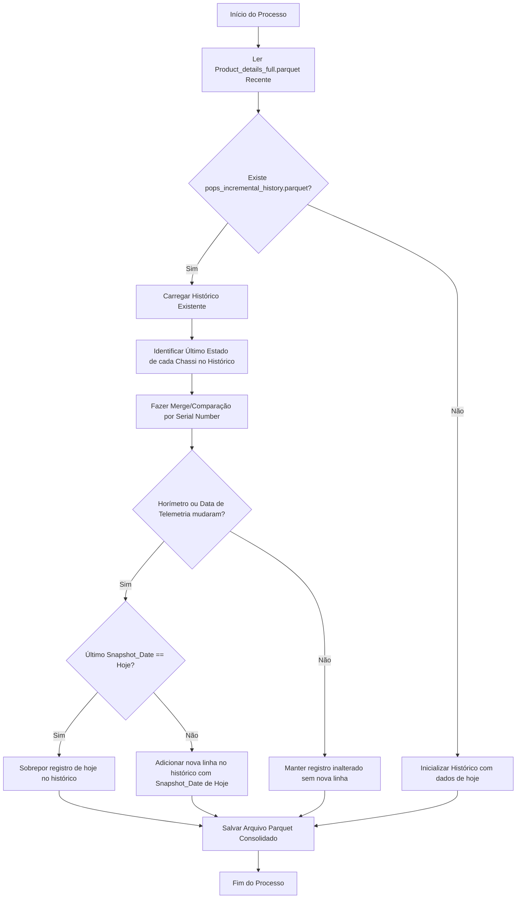

# Spec: Histórico Incremental de Extração de PoPS (SCD Tipo 2 por Chassi)

## 1. Objetivo

Implementar um mecanismo de persistência histórica do parque de máquinas (PoPS/Product Details) que registre a evolução dos horímetros, telemetria (JDLink), serviços e inspeções por chassi. O objetivo é possibilitar estudos analíticos da curva de uso das máquinas e melhorar os modelos preditivos de estimativa de horímetro.

## 2. Escopo

### Em Escopo
- Criação e manutenção do arquivo de histórico acumulado em formato Parquet: `00_PoPS_Extractor/data/historical_pops/pops_incremental_history.parquet`.
- Lógica incremental chassi a chassi: registrar um novo ponto na série temporal somente se houver mudança nas horas (`Forecasted Machine Hours`) ou data de telemetria (`aorLastLocationDate`) de um chassi específico.
- Lógica de limpeza intradia: se o script rodar múltiplas vezes no mesmo dia e houver novas atualizações de chassi, o registro da data atual deve ser sobreposto com a versão mais recente (no máximo 1 registro por chassi por dia).
- Integração do script histórico como parte do processo de ingestão no runner `run.py` ou `load.py` do `00_PoPS_Extractor`.

### Fora do Escopo
- Modelagem preditiva ou extrapolação linear no pipeline principal.
- Criação de visualizações gráficas no CRM ou dashboard.
- Alteração nos estágios de faturamento (M2) ou segmentação (M5).

## 3. Requisitos Funcionais

| ID | Descrição |
|:---|:---|
| **FR-001** | O script SHALL persistir estritamente as 17 colunas originais do PoPS mapeadas no banco histórico, acrescidas de `Snapshot_Date` (data do processamento). |
| **FR-002** | O histórico SHALL ser armazenado no formato binário colunar **Parquet** para máxima compactação de espaço em disco e performance de memória. |
| **FR-003** | O script SHALL realizar a comparação de cada chassi da extração atual contra seu último registro disponível no histórico. |
| **FR-004** | O script SHALL inserir um novo registro para o chassi somente se: (a) o chassi for inédito ou (b) `Forecasted Machine Hours` ou `aorLastLocationDate` apresentarem diferença em relação ao último registro do histórico. |
| **FR-005** | Se o chassi já tiver um registro com `Snapshot_Date` igual à data atual de processamento, o script SHALL sobrepor o registro do dia para evitar duplicidade intradia. |
| **FR-006** | O processo SHALL ser idempotente: execuções repetidas sem novos dados não podem alterar o histórico. |

### 3.1 Colunas Persistidas
O histórico conterá as seguintes colunas correspondentes à extração do PoPS:
1. `Serial Number` (PIN/Chassi)
2. `Average Labor Revenue`
3. `Average Parts Revenue`
4. `Dealer Account Number`
5. `Dealer Location`
6. `Servicing Location Account`
7. `Last Serviced`
8. `Invoice Number`
9. `repairType`
10. `invoiceType`
11. `Last Serviced Account`
12. `AOR Indicator`
13. `aorLastLocationDate`
14. `aorLastLocationType`
15. `Machine Serviced`
16. `Work Order Hours Reported`
17. `Forecasted Machine Hours`
18. `Snapshot_Date` (Coluna incremental informando a data da extração - formato `YYYY-MM-DD`)

## 4. Arquitetura Proposta

### Fluxo de Dados e Gravação Incremental

## 5. Requisitos Não-Funcionais

| ID | Requisito | Rationale |
|:---|:----------|:----------|
| **NFR-001** | Utilização de compressão Snappy no Parquet. | Garante que o arquivo histórico de 1 ano ocupe menos de 10-15MB. |
| **NFR-002** | Tratamento robusto de nulos e encodings UTF-8. | Previne quebras se campos como `Last Serviced` vierem nulos da API. |
| **NFR-003** | Isolamento de diretório. | Armazenamento na pasta física `00_PoPS_Extractor/data/historical_pops/` mapeada no `.gitignore` para evitar vazamento de dados de frota no repositório público. |

## 6. Plano de Validação (Testes)

| ID | Cenário | Resultado Esperado |
|:---|:--------|:-------------------|
| **T-001** | Primeira Execução (Arquivo de histórico inexistente). | O arquivo `pops_incremental_history.parquet` é gerado contendo todos os chassis ativos com a data atual em `Snapshot_Date`. |
| **T-002** | Execução subsequente sem atualizações nos chassis. | Nenhuma linha nova é adicionada ao histórico. O tamanho do arquivo e a quantidade de linhas permanecem inalterados. |
| **T-003** | Alteração de horímetro em 5 chassis no dia seguinte. | Exatamente 5 linhas novas são adicionadas ao histórico com a nova `Snapshot_Date`. |
| **T-004** | Execução repetida no mesmo dia após alteração manual de horas. | Os registros dos chassis afetados são atualizados na partição de hoje, sem duplicar a contagem diária. |
