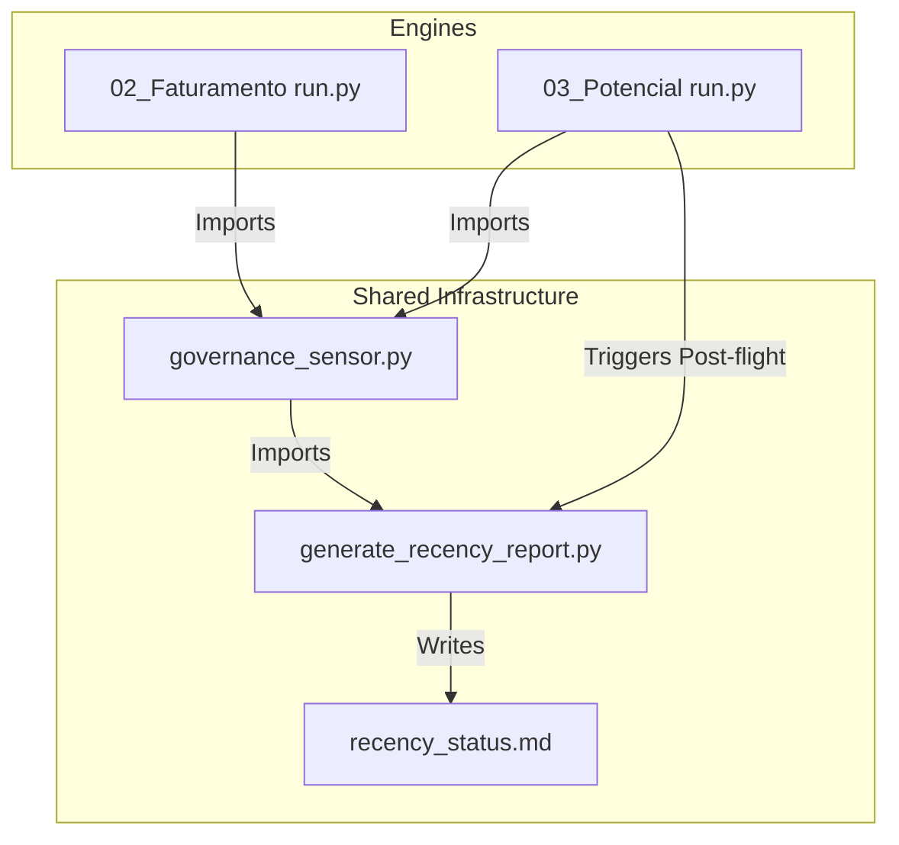

# Especificação Técnica: Governança de Recência de Dados (M3 & M2 Centralizado)

> **Versão:** v1.1 (Auditada e Validada)  
> **Data:** 2026-05-20  
> **Status:** Aprovado (Nível de Governança 2 - Review)  
> **Escopo:** Infraestrutura Compartilhada, Motores M2 (Faturamento) e M3 (Potencial Clientes)  
> **Autor:** Stout Architect Engine & Inova Data Engineering

---

## 📖 1. Contexto e Motivação

O ecossistema analítico da Inova orquestra diversos motores de dados encadeados (M0, M1, M2, M3). Para garantir que decisões de negócio não sejam tomadas com base em dados obsoletos, foi estabelecido um framework de **Governança de Recência**. Este framework realiza verificações de integridade temporal antes da execução de cada motor (**Pre-flight check**) e atualiza o dashboard consolidado após o término de cada processamento (**Post-flight check**).

Esta especificação define a centralização deste sensor de governança, o refactoring do motor M2 para consumir a biblioteca unificada e a implementação do ciclo completo de recência no motor **M3 (Potencial Clientes)**.

---

## 🎯 2. Critérios de Aceitação do Negócio (SOW - GEMINI.md)

Os seguintes critérios de aceitação foram extraídos da governança do negócio e devem ser obrigatoriamente cumpridos pelo escopo de desenvolvimento técnico:

*   **AC-1:** Migração física do validador `governance_sensor.py` para a pasta comum de infraestrutura `/shared/`.
*   **AC-2:** Exclusão da fonte de recência morta `"Vendas M3 RFM"` do monitoramento global e inclusão isolada das duas saídas oficiais do motor M3.
*   **AC-3:** Adaptação da decolagem do motor M2 (`02_Faturamento`) para consumir o sensor centralizado de forma retrocompatível.
*   **AC-4:** Implementação e validação de decolagem de dados no motor M3 (`03_Potencial`) com suporte a execução flexível no ambiente local.
*   **AC-5:** Implementação e disparo de pouso resiliente de dados no motor M3 (`03_Potencial`) com gravação automática no dashboard global.

---

## ⚙️ 3. Requisitos Técnicos de Execução

### 3.1. Requisitos Funcionais (Spec - FR)

*   **FR-001:** O sensor unificado `governance_sensor.py` deve analisar os metadados físicos de escrita dos arquivos locais Parquet sem emitir queries adicionais de rede. *(Implements: AC-1)*
*   **FR-002:** O atualizador do relatório global `/shared/generate_recency_report.py` deve calibrar seu mapeamento para monitorar atômicamente:
    *   `"M3 (Potencial Clientes)"` ➔ `dataset_ouro_potencial_v1.parquet` (SLA: 24 horas).
    *   `"M3 (Potencial por Chassi)"` ➔ `dataset_ouro_potencial_chassi_v1.parquet` (SLA: 24 horas). *(Implements: AC-2)*
*   **FR-003:** O runner `02_Faturamento/run.py` deve realizar a importação de `run_preflight` a partir da biblioteca centralizada sem quebrar sua compatibilidade operacional. *(Implements: AC-3)*
*   **FR-004:** O runner `03_Potencial/run.py` deve incorporar chamada a `run_preflight` na sua inicialização definindo o argumento `fail_fast=False` em modo de simulação local. *(Implements: AC-4)*
*   **FR-005:** Ao salvar com sucesso os arquivos ouro, o runner `03_Potencial/run.py` deve disparar a execução de `/shared/generate_recency_report.py` via subprocesso Python para atualização do dashboard markdown. *(Implements: AC-5)*

### 3.2. Requisitos Não-Funcionais (Spec - NFR)

*   **NFR-001 (Preservação de Rede):** O cálculo de SLA de recência deve ocorrer em menos de 500ms, lendo estritamente o timestamp físico do arquivo Parquet e bloqueando conexões ao Microsoft Fabric para mitigação de custos e concorrência. *(Validates: AC-4)*
*   **NFR-002 (Resiliência de Documentação):** O disparo de subprocesso de atualização de recência no M3 deve rodar com `check=False` envelopado em bloco `try/except Exception` que intercepta qualquer erro de I/O do Windows, prevenindo que falhas de documentação interrompam o pipeline analítico de dados. *(Validates: AC-5)*

---

## 💾 4. Arquitetura Física e Especificações de Código



### 4.1. Centralização do Sensor: `C:\Projetos\Inova\shared\governance_sensor.py`
A lógica de validação de arquivos físicos, conversão de fusos horários e verificação de janelas de SLA deve ser centralizada.
*   **Assinatura Principal:** `run_preflight(shared_dir: str, fail_fast: bool = True) -> bool`

### 4.2. Registro de Fontes no Relatório: `C:\Projetos\Inova\shared\generate_recency_report.py`
O script de consolidação do relatório de status em markdown deve ter seu dicionário de mapeamento de fontes modificado para contemplar a remoção do RFM obsoleto e a adição das duas saídas do M3.

```python
# Contrato de Atualização do Dicionário de Fontes
SOURCES_MAPPING = {
    # ... fontes anteriores (M0, M1, M2)
    "M3 (Potencial Clientes)": {
        "path": "pipelines/potencial-clientes/03_Potencial/data/dataset_ouro_potencial_v1.parquet",
        "sla_hours": 24
    },
    "M3 (Potencial por Chassi)": {
        "path": "pipelines/potencial-clientes/03_Potencial/data/dataset_ouro_potencial_chassi_v1.parquet",
        "sla_hours": 24
    }
}
```

---

## 🚦 5. Matriz de Rastreabilidade (Traceability Matrix)

Esta matriz conecta formalmente os critérios de negócio, requisitos de software implementados e seus cenários correspondentes de teste de validação:

| Critério de Negócio | Requisito Funcional / Não-Funcional | Cenário de Teste / Validação | Status de Rastreabilidade |
| :--- | :--- | :--- | :--- |
| **AC-1 (Sensor Central)** | `FR-001`, `NFR-001` | `T-001 (Lint & Compilação)` | **Conectado (🟢 Completo)** |
| **AC-2 (Calibração Fontes)** | `FR-002` | `T-002 (Geração do Relatório)` | **Conectado (🟢 Completo)** |
| **AC-3 (M2 Retrocompatível)** | `FR-003` | `T-003 (Execução do Motor M2)` | **Conectado (🟢 Completo)** |
| **AC-4 (M3 Pre-flight)** | `FR-004`, `NFR-001` | `T-004 (Homologação Pipeline)` | **Conectado (🟢 Completo)** |
| **AC-5 (M3 Post-flight)** | `FR-005`, `NFR-002` | `T-002 (Geração do Relatório)` | **Conectado (🟢 Completo)** |

---

## 🧪 6. Plano de Verificação Analítica

Os seguintes cenários de teste deverão ser executados para validar a implementação física:

*   **T-001 (Sintaxe e Compilação):** Executar o comando `python -m py_compile` em todos os arquivos alterados e criados.
*   **T-002 (Geração do Relatório):** Confirmar a gravação correta de `C:\Projetos\Inova\shared\recency_status.md` contendo as saídas M3 marcadas com o ícone temporal apropriado baseado na data do arquivo Parquet.
*   **T-003 (Execução do Motor M2):** Executar `C:\Projetos\Inova\pipelines\potencial-clientes\02_Faturamento\run.py` localmente e assegurar compatibilidade retroativa (exit code 0).
*   **T-004 (Homologação Pipeline):** Rodar a esteira integrada local `python validate_pipeline.py --skip-run` para atestar a integridade e ausência de falhas estruturais nos diretórios de cache.
