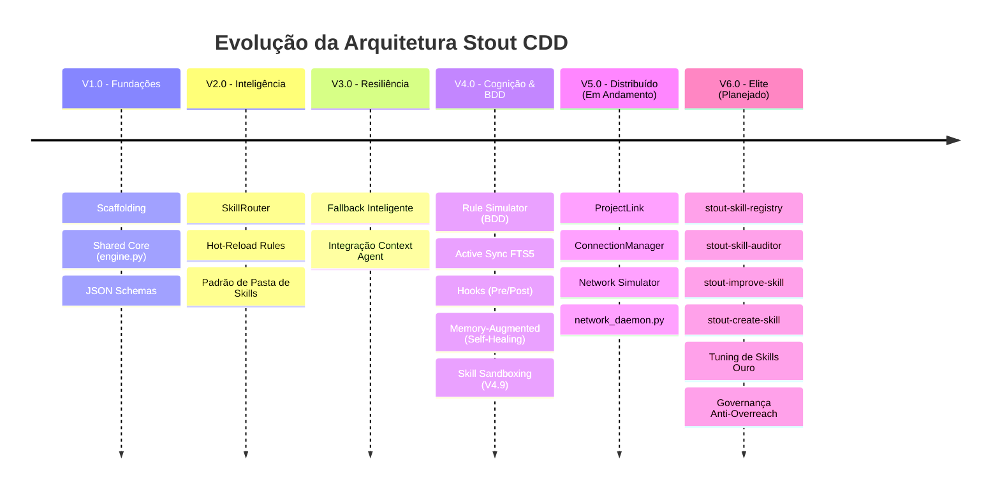

# 🗺️ Roadmap Consolidado Completo: Configuration-Driven Development (CDD) [LEGACY BACKUP]

> **Status:** Ativo / Transição e Consolidação da V5.0 e V6.0
> **Projeto:** Stout Lab CDD
> **Última Consolidação:** 2026-05-20
> **Documento de Governança:** `docs/plans/2026-05-20-roadmap-consolidado-v5.md`

Este documento atua como a **Fonte Única de Verdade (Single Source of Truth - SSOT)** para o Roadmap de CDD. Ele consolida informações que estavam fragmentadas em múltiplos documentos históricos (`roadmap_cdd.md`, `roadmap_cdd_v4.md`, `roadmap_consolidado_historico.md`), planos de execução específicos (V5 e V6) e notas operacionais de sessões de engenharia.

---

## 📊 Linha do Tempo e Evolução do Ecossistema

---

## 1. Fases Concluídas (Baseline Histórico)

### ✅ V1.0: Fundações e Core Engine (Core CDD)
- **Scaffolding Estrutural:** Inicialização sob o padrão Stout-Standard via `stout-init`.
- **Shared Core Engine:** Implementação do motor de processamento (`engine.py`) em `src/core/`.
- **Configuração Multi-Ambiente:** Suporte nativo a variáveis `.env` e controle de execução.
- **Validação de Ciclo:** Fluxo funcional ponta a ponta: *Regra declarativa (rules.yaml) ➔ Motor ➔ Despacho de Skills*.

### ✅ V2.0: Inteligência & Escala (Skill Router)
- **SkillRouter com Progressive Disclosure:** Descoberta dinâmica de caminhos de skills locais e globais.
- **Hot-Reload de Regras:** Recarregamento dinâmico do `rules.yaml` sem interrupção de execução.
- **Validação via JSON Schema:** Criação de contratos formais de integridade de dados para catálogos de regras e skills.

### ✅ V3.0: Resiliência & Fallback (Hardening)
- **Fallback Inteligente:** Mecanismo de desvio seguro caso scripts específicos falhem.
- **Integração de Contexto:** Acoplamento inicial de logs do motor ao `Context Agent` local.

### ✅ V4.0: Cognição, Simulação e Rastreabilidade (BDD & Self-Healing)
- **Rule Simulator (BDD):** Criação do simulador local (`rule_simulator.py`) para testes de regressão de regras em milissegundos sem custos de API.
- **Camada de Cognição Ativa:** Conexão bidirecional com o SQLite FTS5 do `Context Agent` via `gcc_controller.py` para consulta de memória histórica.
- **Analytics Dashboard:** Painel gerencial HTML em `notes/analytics_dashboard.html` visualizando métricas de ativação e intenções órfãs.
- **Hooks CDD:** Suporte total a `pre_action` e `post_action` para execução de scripts pré/pós ativação de regras.
- **Memory-Augmented Rules:** Motor `ContextAugmentor` para auto-recuperação (Self-Healing) baseada em dados de falhas passadas.
- **Elite Context Engineering:** Implementação do `CognitiveSignal` (scoring de relevância de memória) e auditoria preventiva (Sentinela).
- **Skill Sandboxing:** Camada rígida de isolamento de comandos (`src/core/sandbox.py`) controlando timeouts de 30s e whitelist de subprocessos autorizados.

---

## 2. Fase Em Execução (Transição Ativa)

### 🔗 V5.0: CDD Distribuído (ProjectLink)
- [x] **Schema V5 (Handshake):** Definição de contratos de handshake estruturados para conexões inter-projetos.
- [x] **ProjectLink & ConnectionManager:** Gerenciamento físico de pontes de comunicação e conexões remotas.
- [x] **OrchestratorSync:** Motor de sincronização de regras e schemas.
- [x] **Network Simulator:** Suite de testes para simulação de handshakes e transferência de dados inter-workspaces.
- [ ] **network_daemon.py:** Daemon assíncrono em background para sincronização contínua e sem bloqueio entre múltiplos workspaces ativos.

---

## 3. Próximos Desafios e Próxima Fase (V6.0)

### 🔮 V6.0: Ecossistema de Elite & Fábrica de Skills Autônoma

#### Fase 6.1: O Registro e a Auditoria (O Ledger & Porteiro)
- **stout-skill-registry:** Ledger centralizado em `registry.json` para mapear habilidades globais e locais, prevenindo sobreposição ou duplicidade de responsabilidades.
- **stout-skill-auditor:** Componente de governança que varre as skills existentes contra as necessidades declaradas e decide racionalmente se o ecossistema precisa de uma *nova* skill ou de um *upgrade* em uma skill existente.

#### Fase 6.2: O Melhorador e a Fábrica (Upgrade & Manufatura)
- **stout-improve-skill (`apply_patch.py`):** Motor de refatoração autônomo baseado no `elite_audit_report.json`. Ele identifica falhas e gaps de severidade Alta/Média em documentação e implementa patches corretivos de forma cirúrgica.
- **stout-create-skill:** A fábrica agêntica para criação de novas competências a partir de Blueprints e templates do Padrão Ouro (Tier 4).

#### Fase 6.3: Rollout e Harmonização de Elite (Tuning Data)
- **Tuning de Skills Globais:** Refatoração nos moldes Padrão Ouro das skills core de dados: `stout-data-analyze`, `stout-data-sql-queries` e `stout-data-write-query`.
- **Evolução do stout_promote.py:** Implementar a flag `--skill <nome>` para automatizar a higienização de arquivos (remoção de BOM invisível, validação UTF-8) e promoção física segura do `./skills` local para o repositório global.

---

## 🛡️ Pipeline de DNA, Voz e Correções de Infraestrutura (2026-05-18+)

### 🛠️ Correções de Terminal & Conectividade
1. **Central Windows UTF-8 Utility:** Injeção de codec global em `/shared/utils/logging.py` para converter outputs de console Windows de CP1252 para UTF-8 de forma implícita, erradicando os recorrentes `UnicodeEncodeError`.
2. **Conector Local Google Drive:** Criação de barramento de dados direto para leitura e escrita no Drive do usuário sem dependência direta de MCPs globais vulneráveis.
3. **Refatoração de Junctions em `/docs/`:** Ajustar o encadeamento físico das pastas de documentação para evitar loops de referências ou navegações órfãs entre histórico e ambiente ativo.

### 📝 UX & Rastreabilidade do Ciclo Nativo
1. **GitGuard UX:** Detecção do Shell em execução (PowerShell vs Bash vs CMD). Em ambiente PowerShell, substituir o operador `&&` (que quebra com `ParserError`) por `;` ou execução particionada, guiando o desenvolvedor com comandos nativos compatíveis.
2. **Alinhamento Nativo (`write_todos`):** Integração com o fluxo nativo da Gemini CLI para atualização automática dos estados das tarefas no `TODO.md` conforme o plano avança.
3. **Strict CDD Schema Contracts:** Extração de validações de schemas estruturais de ETL de dentro dos scripts de execução para definições declarativas unificadas em `data/config/schemas.json`.
4. **Structured JSON Logger Pattern:** Padronização de saídas de logs operacionais em formato JSON de linha única para processamento estruturado.

### 🚫 Fase 6.4: Governança de Proteção Agêntica (Anti-Overreach Protocol)
- **TDD Hard-Lock:** Impedir qualquer edição em arquivos `.py` se a suíte de testes locais (`pytest`) não estiver active na sessão ou se não houver um teste de falha (Red) explícito.
- **Checkpoint GCC Obrigatório:** Exigir um racional assinado no GCC antes de qualquer mudança estrutural de arquitetura.
- **Aprovação Atômica (Wait-for-Build):** Sinalizador que força a pausa do agente a cada subtarefa executada, evitando exaustão de contexto por execuções em bloco desordenadas.

---

## 📈 Tabela de Cobertura e Estabilidade

| Versão do Core | Status Geral | Cobertura BDD | Confiabilidade do Sandbox |
| :--- | :--- | :--- | :--- |
| **V1.0** | Concluído | 0% | Inexistente (Acesso Direto) |
| **V2.0** | Concluído | 20% | Nível de Processo Básico |
| **V4.0** | Concluído | 100% (32 cenários) | Sandbox Isolado (timeout 30s) |
| **V5.0** | Em Andamento | 85% (Simulação) | Sandbox Isolado + Permissões Rede |
| **V6.0** | Planejado | N/A (Em especificação)| Sandbox Isolado + Hard-Locks |

---

*Assinado com Rastreabilidade GCC:*  
**Gemini CLI Stout Architect**  
*Chave de Assinatura Agêntica: `stout_architectural_alignment_v5`*
