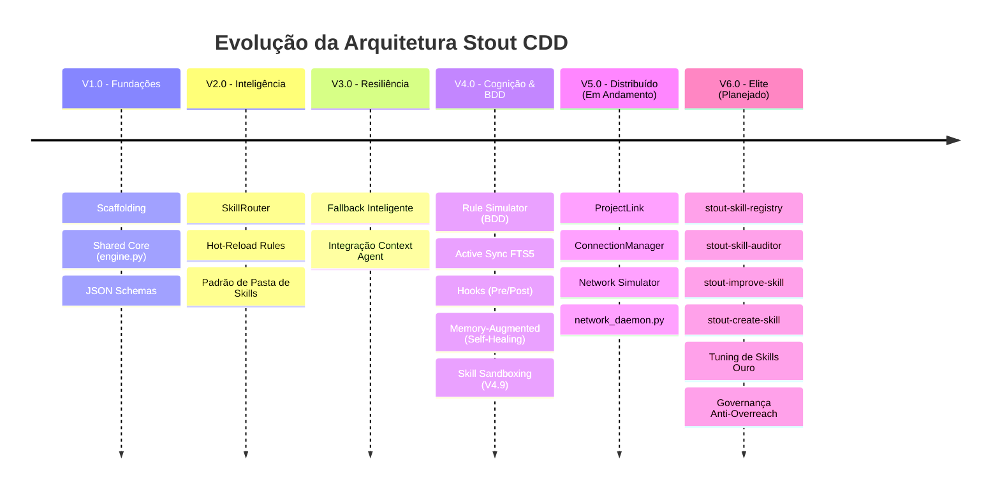

# 📂 Roadmap Consolidado Oficial: Configuration-Driven Development (CDD)

> [!IMPORTANT]
> **Documento de Governança e Fonte Única de Verdade (Single Source of Truth - SSOT)**
> **Status:** Ativo / Transição para V5.0 CDD Distribuído & V6.0 Elite Agêntica
> **Projeto:** Stout Lab CDD
> **Última Atualização:** 2026-05-21 (Local Time)
> **Assinatura:** `stout_architectural_alignment_v5`

---

## 📝 Visão Geral do Projeto
O ecossistema **Configuration-Driven Development (CDD)** tem como propósito padronizar e automatizar a criação, governança e orquestração de soluções e skills no Stout Lab, separando regras de negócio declarativas de seus scripts de execução técnica.

---

## 📊 Linha do Tempo e Evolução do Ecossistema

---

## 🏗️ 1. Fases Concluídas (Baseline Histórico)

### ✅ V1.0: Fundações e Core Engine (Core CDD)
*Foco: Estabelecer o desacoplamento inicial e o motor declarativo.*
- [x] **Scaffolding Estrutural:** Inicialização sob o padrão Stout-Standard via `stout-init`.
- [x] **Shared Core Engine:** Implementação do motor de processamento (`engine.py`) em `src/core/` (Level 3 - Execução).
- [x] **Configuração Multi-Ambiente:** Suporte nativo a variáveis `.env` e controle de execução.
- [x] **Validação de Ciclo:** Fluxo funcional ponta a ponta: *Regra declarativa (rules.yaml) ➔ Motor ➔ Despacho de Skills*.

### ✅ V2.0: Inteligência & Escala (Skill Router)
*Foco: Modularização de habilidades e escalabilidade de regras.*
- [x] **SkillRouter com Progressive Disclosure:** Descoberta dinâmica de caminhos de skills locais e globais.
- [x] **Hot-Reload de Regras:** Recarregamento dinâmico do `rules.yaml` sem interrupção de execução.
- [x] **Validação via JSON Schema:** Criação de contratos formais de integridade de dados para catálogos de regras e skills (`rules.yaml` e `skills_catalog.yaml`).
- [x] **Padrão de Pasta de Skills:** Migração de prompts hardcoded para estrutura modular (Tier 1, 2 e 3).

### ✅ V3.0: Resiliência & Fallback (Hardening)
*Foco: Mitigação de falhas silenciosas e robustez.*
- [x] **Fallback Inteligente:** Mecanismo de desvio seguro caso scripts específicos falhem.
- [x] **Integração de Contexto:** Acoplamento inicial de logs do motor ao `Context Agent` local.

### ✅ V4.0: Cognição, Simulação e Rastreabilidade (BDD & Self-Healing)
*Foco: Automação preventiva de erros e inteligência contextual profunda.*
- [x] **4.1 - Rule Simulator (BDD):** Criação do simulador local (`rule_simulator.py`) para testes de regressão de regras em milissegundos sem custos de API.
- [x] **4.2 - Camada de Cognição Ativa:** Conexão bidirecional com o SQLite FTS5 do `Context Agent` via `gcc_controller.py` para consulta de memória histórica.
- [x] **4.3 - Analytics Dashboard:** Painel gerencial HTML em `notes/analytics_dashboard.html` visualizando métricas de ativação e intenções órfãs.
- [x] **4.4 - Hooks CDD:** Suporte total a `pre_action` e `post_action` para execução de scripts pré/pós ativação de regras.
- [x] **4.5 - Memory-Augmented Rules:** Motor `ContextAugmentor` para auto-recuperação (Self-Healing) baseada em dados de falhas passadas.
- [x] **4.6 - Elite Context Engineering:** Implementação do `CognitiveSignal` (scoring de relevância de memória) e auditoria preventiva pelo `SentinelAgent`.
- [x] **4.7/4.8/4.9 - Protocolo de Imunidade & Sandboxing:** Refatoração do orquestrador V2 com Audit Gate, Sentinel v5 e `SkillSandbox` isolada (`src/core/sandbox.py`) controlando timeouts de 30s e whitelist de subprocessos autorizados.

### ✅ V4.7+ (Governança e Segurança - Hardening)
- [x] **Hardening de Segredos:** Proteção seletiva de `.env` (extração cirúrgica via `os.getenv`).
- [x] **Protocolo CLI (Guardrail V2.0):** Adoção obrigatória de `replace` sobre `write_file` para preservar integridade.
- [x] **Documentação Stout:** Publicação de ADR-0006 e SOP de Diagnóstico.
- [x] **Promoção de Artefatos:** Automatização do versionamento de planos e walkthroughs via `stout_promote.py` (ou `post_approve.py`).

---

## 🌐 2. Fase Em Execução (Transição Ativa)

### 🔗 V5.0: CDD Distribuído (ProjectLink)
*Foco: Comunicação inter-workspaces e replicação assíncrona de regras/skills.*
- [x] **Schema V5 (Handshake):** Definição de contratos de handshake estruturados para conexões inter-projetos.
- [x] **ProjectLink & ConnectionManager:** Gerenciamento físico de pontes de comunicação e conexões remotas.
- [x] **OrchestratorSync:** Motor de sincronização de regras e schemas.
- [x] **Network Simulator:** Suite de testes para simulação de handshakes e transferência de dados inter-workspaces.
- [ ] **network_daemon.py (Foco Imediato):** Daemon assíncrono em background para sincronização contínua e sem bloqueio entre múltiplos workspaces ativos.

### 🛡️ Pipeline de DNA, Voz e Correções de Infraestrutura (Sessão 2026-05-18+)
*Foco: Adaptações robustas de ambiente (Windows), UX agêntica e resiliência contra codecs.*
- [x] **Ajustes de Codificação e Binários:**
    - [x] Normalização de áudio via FFmpeg externo e imposição de console UTF-8.
    - [x] Isolar codec `torchcodec` mitigando conflitos de binários em Windows/Anaconda.
- [x] **Conectividade Local Google Drive:**
    - [x] Implementação do 'Stout Google Drive Connector' local e autônomo (independente de MCP global).
- [ ] **Aprimoramentos de Rastreabilidade e Auditoria:**
    - [ ] Refatoração do sistema de junctions em `/docs/` para unificar navegação active/legacy.
    - [ ] Padronização de ambiente (migrar para venv por projeto e isolar torchcodec/ffmpeg).
    - [ ] Automatização de Auditoria: Integrar `voice-dna-validator` ao `skill-sentinel`.
- [ ] **Central Windows UTF-8 Utility:** Injeção de codec global em `/shared/utils/logging.py` para converter outputs de console Windows de CP1252 para UTF-8 de forma implícita, erradicando os recorrentes `UnicodeEncodeError`.
- [ ] **GitGuard UX:** Detecção do Shell em execução (PowerShell vs Bash vs CMD). Em ambiente PowerShell, substituir o operador `&&` (que quebra com `ParserError`) por `;` ou execução particionada, guiando o desenvolvedor com comandos nativos compatíveis.
- [ ] **Alinhamento Nativo (`write_todos`):** Integração com o fluxo nativo da Gemini CLI para atualização automática dos estados das tarefas no `TODO.md` ou `task.md` conforme o plano avança.
- [ ] **Strict CDD Schema Contracts (Pandera Integration):** Extração de validações de schemas estruturais de ETL de dentro dos scripts de execução para definições declarativas unificadas em `data/config/schemas.json`, elegendo o **Pandera** como engine oficial Python para carregar o dicionário JSON e validar DataFrames em memória de forma transparente.
- [ ] **Fail-Fast JDBC JVM Guard:** Implementação de asserções atômicas ultraleves (ex: `assert not df.empty`, checagem de integridade de chaves primárias do ERP Proteus/CRM) diretamente no final da extração (`extract.py`), blindando o pipeline de erros provocados por anomalias ou timeouts silenciosos na ponte Java/JDBC do Fabric.
- [ ] **Portão de Baseline Histórico (`validate_pipeline.py`):** Formalizar o validador de desvios matemáticos e volumétricos como a ferramenta oficial de auditoria pré-deploy de pipelines em nível local de desenvolvimento, garantindo testes de regressão automatizados contra desvios de dados.
- [ ] **Structured JSON Logger Pattern:** Padronização de saídas de logs operacionais em formato JSON de linha única para processamento estruturado.

---

## 🔮 3. Próximos Desafios e Próxima Fase (V6.0)

### 🔮 V6.0: Ecossistema de Elite & Fábrica de Skills Autônoma
*Foco: Governança agêntica, fábrica modular de skills e auto-otimização.*

#### 3.1. O Registro e a Auditoria (O Ledger & Porteiro)
- [x] **stout-skill-registry (Fase 6.1):** Ledger centralizado em `registry.json` para mapear habilidades globais e locais, prevenindo sobreposição ou duplicidade de responsabilidades.
- [x] **stout-skill-auditor (Fase 6.2):** Componente de governança que varre as skills existentes contra as necessidades declaradas e decide racionalmente se o ecossistema precisa de uma *nova* skill ou de um *upgrade* em uma skill existente.

#### 3.2. O Melhorador e a Fábrica (Upgrade & Manufatura)
- [x] **stout-improve-skill (Fase 6.3):** Motor de refatoração autônomo baseado no `elite_audit_report.json` via script `apply_patch.py`. Identifica falhas e gaps de severidade Alta/Média em documentação e implementa patches corretivos de forma cirúrgica.
- [x] **stout-create-skill (Fase 6.4):** A fábrica agêntica para criação de novas competências a partir de Blueprints e templates do Padrão Ouro (Tier 4).
- [ ] **Rollout de Elite (Tuning Data Intelligence - Fase 6.5):** 
    - [ ] Executar tuning Padrão Ouro em `stout-data-analyze`, `stout-data-sql-queries` e `stout-data-write-query`.
    - [ ] Resolver o loop de bloqueio do GIT GUARD e implementar alinhamento nativo (`write_todos`).
    - [x] Promover o `stout-cdd-orchestrator` como Skill Mãe Global em `.shared-ai-memory`.
- [ ] **Skill Sandboxing Avançado (Fase 6.6):** Implementar isolamento e controle rigoroso de permissões de rede e execução de scripts Level 3.
- [ ] **Melhoria no stout_promote.py (Fase 6.7):** Criar a flag `--skill <nome>` para higienização e promoção automatizada de skills locais para o repositório global.
- [ ] **GitGuard UX Inteligente (Fase 6.8):** Identificar o Shell/SO ativo para sugerir comandos de terminal localizados (substituir `&&` por `;` no PowerShell para evitar ParserError).
- [ ] **Strict CDD Schema Contracts (M0/M5) (Fase 6.9):** Migrar schemas hardcoded de ETL e bancos para definições declarativas estruturadas em `data/config/schemas.json`.
- [ ] **Central Windows UTF-8 Utility (Fase 6.10):** Implementar módulo compartilhado em `/shared/utils/logging.py` contra conflitos de codificação CP1252/UTF-8 em consoles Windows.
- [ ] **Structured JSON Logger Pattern (Fase 6.11):** Padronizar a saída de logs operacionais em JSON estruturado de linha única para facilitar auditorias automáticas.

### 🔧 V6.12: Construção de Skills Core pendentes (Backlog)

*As seguintes skills foram identificadas como cascas vazias na auditoria de 2026-05-21. Elas existem como placeholders no `registry.json` e `rules.yaml`, mas nunca foram implementadas. Precisam ser construídas ou substituídas por alternativas reais.*

- [ ] **stout-self-healing (auto-recuperação):** Motor que detecta padrões de falha conhecidos (`KNOWN_FAILURE_PATTERN`) na memória global do Context Agent e propõe correções preventivas baseadas em histórico. Hoje é uma casca vazia com `{{placeholders}}`.
- [ ] **stout-cdd-technical (motor técnico CDD):** Skill de suporte a dúvidas técnicas sobre a arquitetura CDD — regras, engine, schemas. Deve expor conhecimento do `engine.py`, `rules.yaml` e `skills.schema.json`. Hoje é um template genérico com script corrompido.
- [ ] **stout-knowledge-fallback (fallback de conhecimento):** Skill catch-all para queries não mapeadas pelo motor de regras. Deve responder com contexto do ecossistema Stout (GEMINI.md, ANTIGRAVITY.md, roadmap). Hoje é um boilerplate com `{{query}}`.
- [ ] **stout-welcome (onboarding):** Skill de acolhimento inicial que apresenta o ecossistema CDD ao usuário. Hoje é um template de 16 linhas sem lógica real.

---

## 🚫 4. Protocolo Anti-Overreach: Governança de Proteção Agêntica
*Foco: Garantir conformidade estrita e impedir desvios ou loops de alto custo da IA.*

- [ ] **TDD Hard-Lock:** Impedir qualquer edição em arquivos `.py` se a suíte de testes locais (`pytest`) não estiver activa na sessão ou se não houver um teste de falha (Red) explícito.
- [ ] **Checkpoint GCC Obrigatório:** Exigir um racional assinado no GCC antes de qualquer mudança estrutural de arquitetura.
- [ ] **Aprovação Atômica (Wait-for-Build):** Sinalizador que força a pausa do agente a cada subtarefa de um plano concluída, evitando exaustão de contexto por execuções em bloco desordenadas.

---

## 📈 Tabela de Cobertura e Estabilidade de KPIs

| Versão do Core | Status Geral | Cobertura BDD | Confiabilidade do Sandbox |
| :--- | :--- | :--- | :--- |
| **V1.0** | Concluído | 0% | Inexistente (Acesso Direto) |
| **V2.0** | Concluído | 20% | Nível de Processo Básico |
| **V4.0** | Concluído | 100% (32 cenários) | Sandbox Isolado (timeout 30s) |
| **V5.0** | Em Andamento | 85% (Simulação) | Sandbox Isolado + Permissões Rede |
| **V6.0** | Planejado | N/A (Em especificação) | Sandbox Isolado + Hard-Locks |

---

*Rastreabilidade e Governança Garantidas.*  
**Gemini CLI Stout Architect**  
*Chave de Assinatura Agêntica: `stout_architectural_alignment_v5`*

