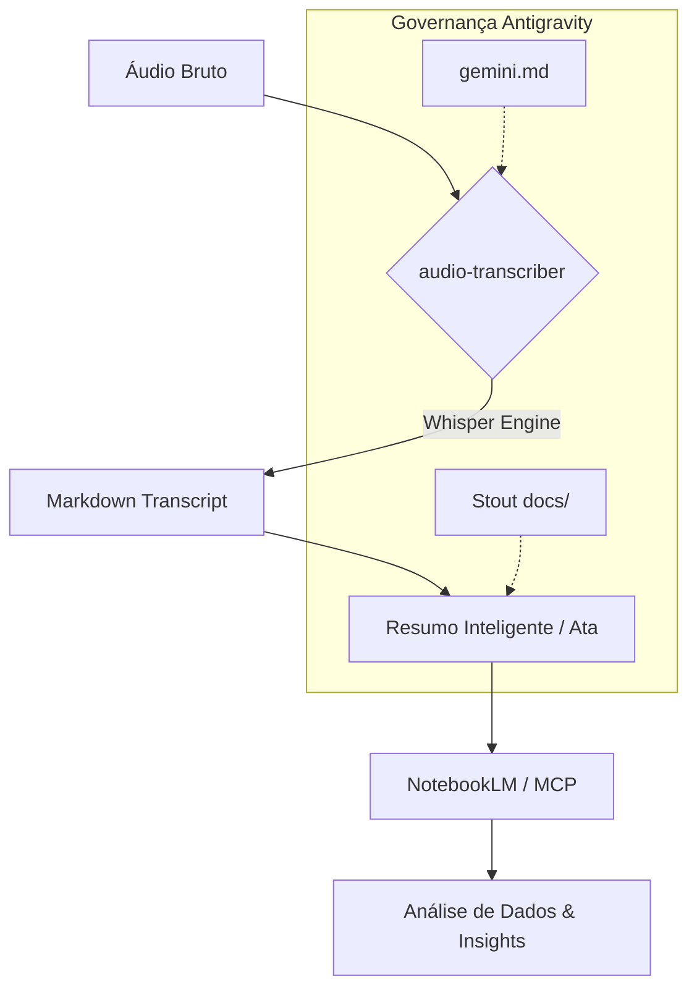

# 🛸 Antigravity: Setup de Transcrição (Stout Edition)

> [!IMPORTANT]
> **Governança de Imutabilidade:** Este plano é a Golden Copy aprovada para a configuração do ambiente. Alterações futuras devem gerar uma v2.

## 🎯 Objetivo
Configurar o ecossistema de transcrição em `C:\Projetos\Transcricoes` integrando as diretrizes do Manifesto Antigravity e o motor de IA `Faster-Whisper`.

---

## 🏗️ Arquitetura do Sistema

---

## 📋 Plano de Ação

| ID | Task | Componente | Status |
|:---|:---|:---|:---:|
| **01** | Manifesto Local | `gemini.md` | ⏳ Pendente |
| **02** | Estrutura Stout | `./docs/` | ⏳ Pendente |
| **03** | Audit de Motor | `Faster-Whisper` | ⏳ Pendente |
| **04** | Memória Atômica | `context-agent` | ⏳ Pendente |

---

## 🛠️ Detalhamento Técnico

### 1. Manifesto Local `gemini.md`
> [!TIP]
> O arquivo será gerado unificando as referências globais de MCP e o manifesto estratégico documentado em `.shared-ai-memory`.

**Arquivos:**
- [NEW] `C:\Projetos\Transcricoes\gemini.md`

---

### 2. Estrutura de Pastas (Stout Standard)
**Arquivos:**
- [NEW] `C:\Projetos\Transcricoes\docs\specs\.gitkeep`
- [NEW] `C:\Projetos\Transcricoes\docs\plans\.gitkeep`

## 🛠️ Pipeline de Execução

### Etapa 1: Transcrição Full (Fidelidade Total)
- **Motor:** `audio-transcriber` (Fast Whisper).
- **Processamento:** Transcrição 1:1 estruturada.
- **Output:** `.md` para auditoria e **`.pdf` para alimentação do NotebookLM**.

### Etapa 2: Ata Executiva (meeting-assistant)
- **Motor:** `meeting-assistant` v1.2.x.
- **Processamento:** Extração de Decisões, Itens de Ação e Mapa Mental.
- **Output:** `.md` conciso para consumo humano.

---

### 3. Verificação de Ferramentas
Validar a saúde do ambiente de áudio:
- **Python:** `faster-whisper`
- **Sistema:** `ffmpeg`

---

## 🛡️ Protocolo de Validação
- [ ] Existência física do `gemini.md` com links funcionais.
- [ ] Retorno positivo do comando `ffmpeg -version`.
- [ ] Confirmação de persistência da spec em `docs/specs/`.

---
*Assinado: Arquiteto de Design Agêntico*
