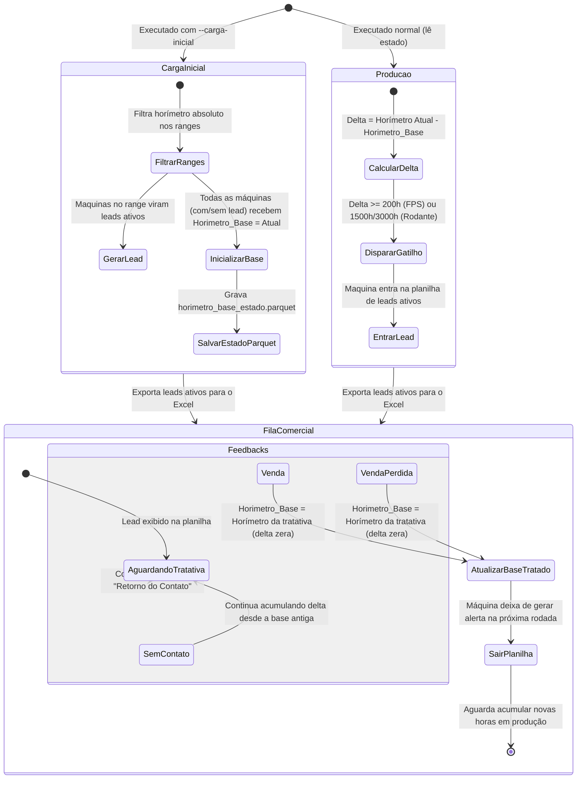

# 🧠 Especificação Técnica: Carga Inicial de Horímetros e Ciclo de Vida dos Alertas (lead-csc-pops)

> **Identidade do Documento:** `./docs/specs/2026-05-28-carga-inicial-horimetro.md`  
> **Data:** 28/05/2026  
> **Status:** Proposta de Especificação (Aguardando Aprovação)  
> **Referência:** [GEMINI.md - leads-csc-pops](file:///C:/Projetos/Inova/projects/lead-csc-pops/GEMINI.md)  
> **Autores:** Victor Bernardi (Analista), Antigravity (Engenheiro de Software)

---

## 🎯 1. Objetivo e Contexto de Negócio

No modelo de alertas preventivos de pós-vendas da Inova Máquinas, a geração indiscriminada de leads no momento de implantação da campanha (marco zero) causaria a saturação do time de pós-vendas com milhares de oportunidades frias ao mesmo tempo.

Esta especificação define o comportamento do mecanismo de **Carga Inicial (Bootstrap)** e a transição robusta para o **modo Produção**, ativado de forma explícita por parâmetro de console. O motor passará a filtrar na carga inicial apenas as máquinas da frota ativa (já pré-filtrada por idade pelo motor M3) cujos horímetros de desgaste encontram-se exatamente dentro de ranges de tolerância específicos.

---

## ⚙️ 2. Requisitos de Negócio e Funcionais

### RF-01: Ranges Absolutos de Tolerância (Carga Inicial)

Quando a execução for configurada com o parâmetro de carga inicial, os alertas serão calculados em relação ao **horímetro absoluto atual da máquina** (`Work Order Hours Reported` extraído do M3), aplicando-se os seguintes intervalos:

#### A. Ferramentas de Penetração de Solo (FPS) - Carregadeiras e Outras

* **Gatilho cíclico:** A cada 200 horas de operação.
* **Range de tolerância absoluto (Carga Inicial):** 50h de largura para cada ciclo.
* **Matemática de Alerta:**
    $$(h \ge 200.0) \land ((h \pmod{200.0}) \le 50.0)$$
* *Exemplos de ranges:* `[200-250]`, `[400-450]`, `[600-650]`, `[800-850]`, ..., `[20000-20050]`.

#### B. Material Rodante (Tratores de Esteira)

* **Gatilho cíclico:** A cada 1.500 horas de operação.
* **Range de tolerância absoluto (Carga Inicial):** 500h de largura para cada ciclo.
* **Matemática de Alerta:**
    $$(h \ge 1500.0) \land ((h \pmod{1500.0}) \le 500.0)$$
* *Exemplos de ranges:* `[1500-2000]`, `[3000-3500]`, `[4500-5000]`, `[6000-6500]`, ..., `[15000-15500]`.
* *Modelos elegíveis:* Modelos com `700J`, `750J`, `850J`, `1050K` no nome ou família contendo `TRATORES DE ESTEIRA`.

#### C. Material Rodante (Escavadeiras)

* **Gatilho cíclico:** A cada 3.000 horas de operação.
* **Range de tolerância absoluto (Carga Inicial):** 1.000h de largura para cada ciclo.
* **Matemática de Alerta:**
    $$(h \ge 3000.0) \land ((h \pmod{3000.0}) \le 1000.0)$$
* *Exemplos de ranges:* `[3000-4000]`, `[6000-7000]`, `[9000-10000]`, `[12000-13000]`, ..., `[30000-31000]`.
* *Modelos elegíveis:* Modelos com `130G`, `130P`, `160G`, `160P`, `180G`, `200G`, `200P`, `210G`, `210P`, `350ZX`, `350G`, `350P` no nome ou família contendo `ESCAVADEIRAS`.

---

## 💾 3. Gestão de Estado e Ciclo de Vida do Lead

A persistência do marco de horímetro é gerida pelo arquivo físico isolado `data/output/horimetro_base_estado.parquet`. O comportamento do ciclo de vida segue a engrenagem descrita abaixo:



### Regras do Estado

1. **Carga Inicial:**
    * Filtra apenas as máquinas nos ranges de tolerância absoluto.
    * A planilha final `.xlsx` conterá **apenas** essas máquinas alertadas.
    * O arquivo de estado `horimetro_base_estado.parquet` é gravado com o horímetro absoluto atual de **todas** as máquinas (com e sem lead) registrado como seu `Horimetro_Base`.
    * O delta inicial exibido para esses leads na planilha é **0** (uma vez que `Horimetro_Base = Horimetro_Atual` e o delta é `Horimetro_Atual - Horimetro_Base`). Esse delta representa a quantidade de horas desde que a máquina entrou no lead.
2. **Operação em Produção:**
    * Calcula o `Delta_Horas = Horimetro_Atual - Horimetro_Base`.
    * Aciona o alerta caso o delta supere o gatilho (`>= 200h`, `>= 1500h`, `>= 3000h`).
    * A planilha final `.xlsx` conterá apenas as máquinas cujos deltas dispararam. O delta exibido na planilha representará o desgaste acumulado desde a última tratativa.
3. **Tratativa e Reentrada Comercial:**
    * Se o feedback na planilha lida for `Venda` ou `Venda Perdida`, o `Horimetro_Base` é atualizado para o horímetro lido daquela máquina.
    * Como o `Horimetro_Base` passa a ser igual ao horímetro da tratativa, o seu delta de horas é resetado para **0**, fazendo com que a máquina **saia da planilha** na execução seguinte.
    * Ela permanecerá fora da planilha até acumular horas de desgaste suficientes na produção para atingir o gatilho cíclico novamente, nascendo com o delta zerado a partir do novo marco.

---

## 🚀 4. Proposta de Alterações Técnicas

### A. Modificação em `run.py`

1. Adicionar o parâmetro `--carga-inicial` (booleano) via `argparse`.
2. Configurar a variável `carga_inicial` de acordo com a presença do parâmetro no terminal:

    ```python
    carga_inicial = args.carga_inicial
    ```

3. Remover o bypass automático que desativava a carga inicial quando a média do horímetro era superior a 500h.
4. Garantir que a inicialização do estado se adeque ao fluxo:
    * Se for `--carga-inicial` (mesmo se o arquivo de estado já existir), ele sobrescreve os horímetros base de todos os chassis com seus horímetros atuais, e executa a transformação no modo Bootstrap.
    * Se for execução normal e o arquivo de estado existir, ele recupera o estado histórico e executa em modo Produção baseando-se no delta. Se o estado não existir, avisa no console exigindo uma carga inicial prévia ou inicializa em produção a partir do marco atual.

### B. Modificação em `src/transform.py`

1. Ajustar a regra de Material Rodante de Tratores na Carga Inicial para aplicar o range simples unificado de 500h:

    ```python
    df.loc[trator_mask & (h >= 1500.0) & ((h % 1500.0) <= 500.0), 'Alerta_Rodante'] = True
    ```

2. Ajustar o cálculo de `Delta_Horas` para ser exatamente a diferença de desgaste desde a base gravada.

---

## 🧪 5. Plano de Validação e Testes (TDD Iron Law)

Para assegurar a conformidade, os testes unitários em `tests/test_transform.py` devem ser adaptados e executados antes de declarar a implementação concluída:

1. **`test_calcular_alertas_carga_inicial_bootstrap`:**
    * FPS com 220h (range `[200-250]`) $\rightarrow$ Alerta FPS = True.
    * FPS com 310h (fora do range) $\rightarrow$ Alerta FPS = False.
    * Trator com 1800h (range `[1500-2000]`) $\rightarrow$ Alerta Rodante = True (novo comportamento unificado de 500h).
    * Trator com 2200h (fora do range) $\rightarrow$ Alerta Rodante = False.
    * Trator com 3200h (range `[3000-3500]`) $\rightarrow$ Alerta Rodante = True.
    * Escavadeira com 3500h (range `[3000-4000]`) $\rightarrow$ Alerta Rodante = True.
    * Escavadeira com 4800h (fora do range) $\rightarrow$ Alerta Rodante = False.
2. **Execução de Dry-Run via PowerShell:**
    * Simular uma carga inicial:

        ```powershell
        python run.py --carga-inicial
        ```

    * Verificar se a planilha final foi gerada com a quantidade exata de chassis que caíram nos ranges absolutos de desgaste.
    * Verificar se o arquivo `horimetro_base_estado.parquet` foi gerado com os horímetros base de 100% dos chassis.

---

## ✍️ 6. Conclusão

Esta especificação formaliza o comportamento desejado para o motor preventivo da Inova Máquinas.
