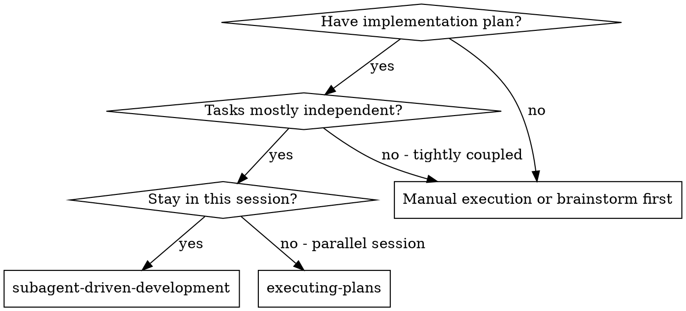
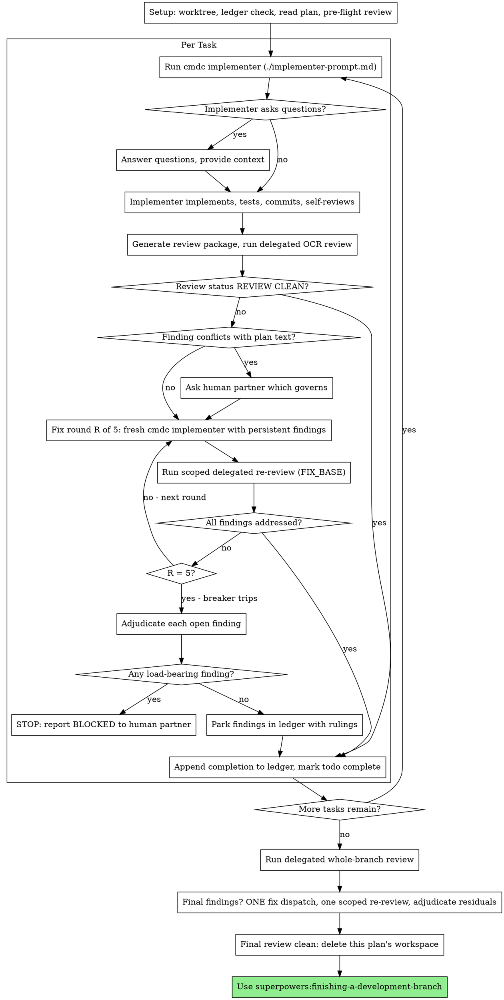

# SDD via Command Code with delegated Open Code Review

Execute the plan by running one fresh Command Code implementer per task, a
delegated Open Code Review (task spec compliance + code quality) after each,
and a broad delegated whole-branch review at the end. Every review — task
review, fix re-review, and final review — uses the `open-code-review-delegate`
subskill with `ocr delegate preview` followed by `ocr delegate rule`; no
review is ever routed to a Codex reviewer.

**Backend boundary:** implementation runs only through
`scripts/cmdc-implementer.py` (Command Code, fixed model
`deepseek/deepseek-v4-flash`); reviewers, re-reviewers and the final reviewer
run in the host session through delegated OCR, never through Codex review
prompts. A Command Code failure is fail-closed: report its structured blocker
and do not silently implement the task in Codex. An OCR failure is
fail-closed: `BLOCKED` or `REVIEW INCOMPLETE`, never approval, and never a
silent fallback to an ordinary Codex review.

**Delegated review only:** `ocr review`, `ocr llm test`, `OCR_LLM_*` and
`OPENAI_API_KEY` are outside this workflow and must never be executed or set.
The host session performs the reasoning and writes the review report; OCR
performs deterministic file selection and rule resolution. The ChatGPT Pro
session is never transformed into an API credential. Automatic GitHub PR
comment publication is out of scope — never publish review comments to
GitHub.

**Why subagents:** You delegate tasks to specialized agents with isolated
context. By precisely crafting their instructions and context, you ensure
they stay focused and succeed at their task. They should never inherit your
session's context or history — you construct exactly what they need. This
also preserves your own context for coordination work.

**Core principle:** Fresh subagent per task + delegated task review (spec +
quality) + broad delegated final review = high quality, fast iteration

## Canonical Run Contract lifecycle

The governed execution authority is a Run Contract schema version 1, not a
prompt or a mutable CLI argument list. The Contract is immutable and is
persisted with one Run Record under `contract.json`, append-only
`events.jsonl` and `checkpoints.jsonl`, and the atomically current
`result.json`. The Run Result is the transactional authority; the
Implementer Report is the human-readable Markdown account and is not a
substitute for Result evidence.

The canonical entry points are:

```powershell
python scripts/cmdc-implementer.py start --contract-file PATH\contract.json
python scripts/cmdc-implementer.py resume --cwd REPOSITORY --run-id RUN_ID
```

`start --contract-file` loads one existing Contract or creates its one owned
Run Record. `resume --cwd ... --run-id ...` locates exactly one owned Run and
revalidates its Contract SHA-256, base HEAD, branch, Checkpoint ownership and
sequence, captured Session ID, known workspace fingerprint, and scope before
creating a process. Recovery never reconstructs authority from a new prompt.

Scope is explicit when the Contract declares allowed and denied paths, or is
deterministically derived from the task `Files`/`Arquivos` section by the
Windows `scripts/task-brief.py` entry point. Missing scope is
`SCOPE_CONTRACT_MISSING`, never an implicit allow-all decision. The pre-tool Mod
checks direct write/edit targets; the post-shell audit and final audit
compare the Git workspace against the baseline and allowed Run paths. An
unknown direct or indirect change remains present and blocks the Result.

The first execution uses one Command Code Session. A `WORKER_TURN_LIMIT` may
automatically enter same Command Code Session Recovery while the configured
attempt budget and cleanup evidence permit it. `STALLED` and wall timeout
remain explicit `INCOMPLETE` outcomes until the operator invokes the exact
`resume --cwd REPOSITORY --run-id RUN_ID` command. Recovery must use the same
Session ID and Mod/scope environment; a different returned Session is
`CMD_CODE_PROTOCOL_ERROR`. The early progress deadline is recorded as
`NO_IMPLEMENTATION_PROGRESS`. Test approval comes only from normalized test events
with a successful tool result, never from agent prose or a Markdown
claim. The external plan and task-brief provenance remain tied to the recorded
repository, branch, commit, paths, and SHA-256. There is no generic allow-dirty Recovery bypass: pre-existing changes
are accepted only when they match the recorded baseline and remain untouched.

The legacy flat adapter remains available for compatibility and retains its
legacy report-marker parsing only for old calls. New governed work must use
the canonical Contract/Record/Result path; legacy `--allow-dirty` behavior
does not authorize canonical Recovery or weaken scope, provenance, cleanup,
or Result gates.

**Narration:** between tool calls, narrate at most one short line — the
ledger and the tool results carry the record.

**Continuous execution:** Do not pause to check in with your human partner
between tasks. Execute all tasks from the plan without stopping. The only
reasons to stop are: BLOCKED status you cannot resolve, ambiguity that
genuinely prevents progress, or all tasks complete. "Should I continue?"
prompts and progress summaries waste their time — they asked you to execute
the plan, so execute it.

## When to Use



**vs. Executing Plans (parallel session):**
- Same session (no context switch)
- Fresh subagent per task (no context pollution)
- Delegated review after each task (spec compliance + code quality), broad
  delegated review at the end
- Faster iteration (no human-in-loop between tasks)

## The Process



## Setup

Ensure the work happens in an isolated workspace: use
superpowers:using-git-worktrees to create one or verify the existing one.
Never start implementation on a main/master branch without your human
partner's explicit consent.

Conversation memory does not survive compaction. In real sessions,
controllers that lost their place have re-dispatched entire completed task
sequences — the single most expensive failure observed. Track progress in
a ledger file, not only in todos.

- Each plan owns a workspace: at skill start, run this skill's
  `scripts/sdd-workspace PLAN_FILE` — it prints the plan's git-ignored
  directory (`<repo-root>/.superpowers/sdd/<plan-basename>/`), home to
  every artifact for THIS plan: ledger, briefs, reports, review packages.
  Another plan's directory is never yours to read or write.
- Check for this plan's ledger at `<workspace>/progress.md`. If its first
  line names your plan file, tasks with a `Task <N>: complete` line are DONE
  — do not re-dispatch them; resume at the first task without one. A task
  whose last line is a fix round is mid-loop: resume the loop at the next
  round. A ledger whose first line names a different plan file — or a stray
  ledger at the old flat path `.superpowers/sdd/progress.md` — is another
  plan's progress: leave it in place and start your own, fresh.
- Create the ledger with its identity as the first line:
  `# SDD ledger — plan: <plan file path>`.
- The ledger is your recovery map: the commits it names exist in git even
  when your context no longer remembers creating them. After compaction,
  trust the ledger and `git log` over your own recollection.
- `git clean -fdx` will destroy the workspace (it's git-ignored scratch); if
  that happens, recover from `git log`.

Read the plan once, note its context and Global Constraints, and create a
todo per task.

Before dispatching Task 1, scan the plan once for conflicts:

- tasks that contradict each other or the plan's Global Constraints
- anything the plan explicitly mandates that the review rubric treats as a
  defect (a test that asserts nothing, verbatim duplication of a logic block)

Present everything you find to your human partner as one batched question —
each finding beside the plan text that mandates it, asking which governs —
before execution begins, not one interrupt per discovery mid-plan. If the
scan is clean, proceed without comment. The review loop remains the net for
conflicts that only emerge from implementation.

## Model Selection

### Implementer backend

- Every implementation task and every implementation fix round invokes
  `scripts/cmdc-implementer.py`.
- The adapter always passes `--model deepseek/deepseek-v4-flash` and defaults to
  `--max-turns 100`, matching the Command Code CLI default. The turn budget is
  separate from the finite wall-clock watchdog, which defaults to four hours
  and is recorded in the heartbeat evidence. `--timeout-seconds` is accepted
  as the explicit alias for `--wall-timeout-seconds`; both spellings bound the
  same finite child-process watchdog, and the caller's outer process window
  must not be shorter than that watchdog. A separate stall watchdog defaults
  to 15 minutes without a streamed CMDc event or observable workspace change;
  a stall is `IMPLEMENTATION INCOMPLETE`, produces an event log, and does not
  trigger automatic recovery. Set `--stall-timeout-seconds 0` only when the
  task's own contract requires disabling stall detection.
- Every invocation must supply `--plan-file`; the adapter validates the
  canonical repository root, the cwd/plan containment inside it, and the
  initial Git snapshot before any child process starts. A blocked boundary
  emits the stable structured `BLOCKED` diagnostic and never spawns Command
  Code.
- The same preflight also validates the prompt as an existing, regular,
  readable UTF-8 file, requires the prompt to declare a report path, and
  keeps report/checkpoint outputs inside the canonical repository. Invalid
  artifacts emit `BLOCKED` codes such as `PROMPT_NOT_FOUND`,
  `PROMPT_UNREADABLE`, `REPORT_PATH_MISSING`,
  `REPORT_OUTSIDE_REPOSITORY`, or `CHECKPOINT_OUTSIDE_REPOSITORY` before
  CMDc starts. Controller-owned prompt files may live in a temporary
  directory; mutable report/checkpoint paths may not.
- The initial snapshot records the canonical repository root, branch, HEAD,
  and the raw `git status --short --untracked-files=all` lines verbatim —
  leading status-column whitespace is preserved, never erased or normalized.
  Blocked results keep the captured `initial_git_state` when Git state was
  captured (protected branch, dirty worktree, deployed/server path).
- On `main`/`master` the adapter requires both `--allow-protected-branch`
  and a ledger entry containing `ALLOW_PROTECTED_BRANCH`; the adapter option
  alone is never enough.
- Normal invocations omit `--yolo`; only the explicit `--allow-cmdc-yolo`
  adapter option adds it. Name the resulting mode (`normal` or `yolo`) in
  diagnostics and report context so the orchestrator sees how Command Code
  was invoked.
- The report/checkpoint context carries the preflight snapshot, and failures
  remain fail-closed: a boundary failure blocks before any child process,
  and a timed-out child never claims success.
- The adapter passes `--no-skills` so the implementation worker cannot load
  global orchestration/reviewer skills and recursively spend its turn budget
  planning the SDD workflow. Its only workflow context is the focused prompt,
  brief, report and repository files supplied by the controller.
- On Windows, resolve `cmdc`, `cmdc.ps1` or `cmdc.cmd`; reject the native
  `C:\Windows\System32\cmd.exe` as the backend.
- Never route implementation to a Codex worker and never silently fall back to
  Codex when Command Code is unavailable.

### Shared process and local launcher Modules

- `scripts/sdd_cmdc_opencode/process_supervisor.py` is the single process
  lifecycle Module for both `cmdc-implementer.py` and `review-session.py`.
  It owns argument-array spawn, UTF-8 replacement, streamed stdout/stderr,
  wall and stall watchdogs, termination, final drain, and verified cleanup.
  Adapters must not carry a second process-tree implementation.
- On native Windows the supervisor assigns the bootstrap to a Job Object before
  the target starts. Cleanup is verified from Job Object accounting; a leader
  exit alone is never proof. A timeout remains the primary failure when
  termination, cleanup, or drain produces secondary evidence.
- `scripts/sdd_cmdc_opencode/cmdc_local.py` owns local launcher discovery,
  platform wrapper argument arrays, the fixed model/output/security flags,
  validated Mod paths, and the local NDJSON translation. Resolution failures
  stay distinct from `LAUNCHER_NOT_FOUND`, `LAUNCHER_UNSUPPORTED`,
  `PROCESS_SPAWN_FAILED`, `WALL_TIMEOUT`, `STALLED`,
  `PROCESS_CLEANUP_UNVERIFIABLE`, `PROCESS_TREE_TERMINATION_FAILED`,
  `PROCESS_DRAIN_FAILED`, and `CMD_CODE_PROTOCOL_ERROR`.
- Deterministic fake-launcher tests are separate from the installed-launcher
  smoke. Set `SDD_CMDC_REAL_SMOKE=1` only for the real gate; it requires a
  temporary Git repository, bounded `--max-turns 2`, JSON output, a verified
  Mod-hook marker, `cleanup_verified`, and `drain_verified`. A skipped real
  gate is reported as unavailable operational evidence, not as success.

### Reviewer backend

- Every review — task review, scoped re-review, and the final whole-branch
  review — uses the `open-code-review-delegate` subskill in the host
  session: `ocr delegate preview` for the exact repository and range,
  then `ocr delegate rule` for every reviewable path.
- Never dispatch a Codex reviewer. This skill ships no reviewer prompts:
  there is no Codex review stage and no other mechanism replaces the
  delegated flow.
- Reviewer quality and review-loop rules remain the same as the source SDD,
  but the review mechanism is delegated OCR only.

## The Task Loop

Everything you paste into a dispatch prompt — and everything a subagent
prints back — stays resident in your context for the rest of the session
and is re-read on every later turn. Hand artifacts over as files.

### 1. Run the Command Code implementer

Record BASE (`git rev-parse HEAD`) before running Command Code — the review
package and fix-round diffs need it.

- **Task brief:** before running an implementer, run this skill's
  `scripts/task-brief PLAN_FILE N` — it extracts the task's full text to a
  uniquely named file and prints the path. The extractor accepts both
  `Task N` and `Tarefa N` headings (including numbered-list prefixes),
  ignores headings inside fenced code, and atomically replaces the output
  only after a non-empty extraction. Compose the dispatch so the
  brief stays the single source of
  requirements. Your dispatch should contain: (1) one line on where this
  task fits in the project; (2) the brief path, introduced as "read this
  first — it is your requirements, with the exact values to use verbatim";
  (3) interfaces and decisions from earlier tasks that the brief cannot
  know; (4) your resolution of any ambiguity you noticed in the brief;
  (5) the report-file path and report contract. Exact values (numbers,
  magic strings, signatures, test cases) appear only in the brief. Never
  make a subagent read the whole plan file.
- **Report file:** name the implementer's report file after the brief
  (brief `…/task-N-brief.md` → report `…/task-N-report.md`) and put it in
  the dispatch prompt. The implementer writes the full report there and
  returns only status, commits, a one-line test summary, and concerns.
- The Command Code prompt describes one task, not the session's history. Do not
  paste accumulated prior-task summaries ("state after Tasks 1-3") into
  later dispatches — a real session's dispatch hit 42k chars of which 99%
  was pasted history. A fresh subagent needs its task, the interfaces it
  touches, and the global constraints. Nothing else.
- If an earlier task parked a finding in the area this task touches, carry
  a pointer to that ledger entry in the dispatch.
- There is no live implementer identity to resume. Each task and fix round is
  a fresh Command Code process; the brief, report and ledger are its persistent
  context.
- Never run multiple implementation processes in parallel (conflicts).

Create a focused prompt file containing the brief path, report path, relevant
interfaces, resolved ambiguities, global constraints and the required report
contract. Then run:

```powershell
$skillDir = (Resolve-Path "<path-to-this-skill>").Path
$workspace = (Get-Location).Path
& python (Join-Path $skillDir "scripts\cmdc-implementer.py") `
  --cwd $workspace `
  --prompt-file "<cmdc-prompt-file>" `
  --plan-file "<plan-file>" `
  --max-turns 100 `
  --checkpoint-file "<checkpoint-file>" `
  --heartbeat-interval 30 `
  --timeout-seconds 14400 `
  --stall-timeout-seconds 900 `
  --recovery-max-turns 5
```

`--timeout-seconds` is the explicit spelling of the same finite process
watchdog as `--wall-timeout-seconds` (the two flags are aliases; the adapter
window defaults to four hours). The caller's outer process window that owns
this dispatch must be at least as long as the adapter window — the adapter
can only bound its own child process, never a parent process that would kill
it before the commit and report exist.

The adapter's JSON event log, stdout, stderr and exit code are part of the
dispatch result. A non-zero result or missing report emits `STATUS: BLOCKED` with
`BLOCKER_CODE`, `MESSAGE`, `COMMAND`, `EXIT_CODE`, `STDERR` and `ACTION`; write
that reason into the ledger and do not generate a review package. A wall-clock
timeout or stall emits `STATUS: IMPLEMENTATION INCOMPLETE`, appends a
`TIMED_OUT` JSONL checkpoint and blocks review/next-task progression. In the
canonical Run lifecycle this is a persisted `INCOMPLETE` Result that requires
explicit same-session Recovery through `resume --cwd REPOSITORY --run-id RUN_ID`;
the wall-timeout/stall path never silently creates a new Session. The legacy
flat adapter retains its bounded compatibility output: a successful legacy
recovery emits `STATUS: RECOVERED`, and package generation is permitted only
after the normal delegated review gates are rechecked.
- Recovery never replaces the primary failure. In an incomplete result,
  `PRIMARY_BLOCKER_CODE`, `PRIMARY_PHASE`, and `PRIMARY_COMMAND` identify the
  original watchdog/worker failure; canonical `RecoveryEvidence` records the
  same Session attempt and any Recovery blocker only as secondary evidence. A
  normal CMDc exit at turn budget is reported as `WORKER_TURN_LIMIT`;
  `WALL_TIMEOUT`, `STALLED`, and launcher/spawn failures remain distinct and
  launcher/scope/cleanup failures are non-resumable.
An exit code `4` is classified as `PERMISSION_DENIED`; the headless adapter
does not wait for an interactive permission answer.

**Installation parity.** The canonical source is this checkout's
`skills/sdd-cmdc-opencode`. Before publishing an installation, run the
read-only audit below for every target copy. It reports `MISSING`, `EXTRA`, and
`CHANGED` files and never modifies either tree:

```powershell
python scripts/verify-install-parity.py `
  skills/sdd-cmdc-opencode `
  "$env:USERPROFILE\.agents\skills\sdd-cmdc-opencode" `
  "$env:USERPROFILE\.codex\skills\sdd-cmdc-opencode"
```

Do not delete or overwrite a target to make the audit pass without a separate
publication authorization; an extra model-override test or a diverging
adapter is a release blocker.

Template: [implementer-prompt.md](implementer-prompt.md)

### 2. Handle the report

Command Code implementers report one of four statuses. Handle each appropriately:

**DONE:** Generate the review package (`scripts/review-package PLAN_FILE BASE HEAD`, from this skill's directory — it prints the unique file path it wrote; BASE is the commit you recorded before running the implementer — never `HEAD~1`, which silently drops all but the last commit of a multi-commit task), then run the delegated OCR task review with the printed path.

**DONE_WITH_CONCERNS:** The implementer completed the work but flagged doubts. Read the concerns before proceeding. If the concerns are about correctness or scope, address them before review. If they're observations (e.g., "this file is getting large"), note them and proceed to review.

**NEEDS_CONTEXT:** The implementer needs information that wasn't provided. Provide the missing context and run a fresh Command Code invocation with the same fixed model.

**BLOCKED:** The implementer cannot complete the task. If the adapter emitted a
structured `BLOCKED` diagnostic, append its code/message/action to the ledger,
do not dispatch a reviewer, and report the infrastructure blocker to the human.
If the Command Code worker itself returned `BLOCKED`, assess its report:
provide missing context and run a fresh Command Code invocation with the same
fixed model, or escalate a plan defect to the human.

**Never** ignore an escalation or force the same model to retry without changes. If the implementer said it's stuck, something needs to change.

If the implementer asks questions — before starting or mid-task — answer
clearly and completely, provide additional context if needed, and don't
rush it into implementation.

### 3. Review the task

Per-task reviews are task-scoped gates. The broad review happens once, at the
final whole-branch review. Never skip the task review, and never accept a
report missing either verdict — spec compliance AND task quality are both
required. Implementer self-review never replaces the task review; both are
needed.

Every review — task review, fix re-review, and final whole-branch review —
follows the same delegated OCR flow through the `open-code-review-delegate`
subskill:

1. Generate the review package for audit evidence with the exact range:
   `scripts/review-package PLAN_FILE BASE HEAD` for a task review,
   `scripts/review-package PLAN_FILE FIX_BASE HEAD` for a re-review, and
   `scripts/review-package PLAN_FILE MERGE_BASE HEAD` for the final review.
   Use the BASE you recorded before dispatching the implementer — never
   `HEAD~1`, which silently truncates multi-commit tasks.
2. Run `ocr delegate preview` for that exact repository and range. The
   preview resolves the reviewable scope: mode, merge_base, commit and `to`
   metadata, plus the excluded paths and their reasons.
3. Stop as BLOCKED if the preview fails or the scope is incomplete: a
   timeout, a partial preview, or an excluded file without justification
   recorded in the preview output is never approval. Re-run the preview
   with a higher limit, or escalate as BLOCKED.
4. Run `ocr delegate rule` for every reviewable path, in batches if the
   path list is large. Every path the preview resolved must be covered by
   a rule run; a rule that cannot be resolved is a blocker, not a skip.
5. Read each exact diff for every reviewable path, using the mode and ref
   metadata (`mode`, `merge_base`, `commit`, `to`) returned by the preview.
6. Review each file against its resolved rule group and repository context,
   and report findings in the delegated Open Code Review format.
7. Treat Critical/High findings as blocking and run a fresh Command Code fix
   round (section 4). Report Medium findings with context. Discard only
   clearly low-value false positives, recording that decision.
8. Re-run only the fix range through delegated preview/rule/diff review
   after a fix round (section 4).

**Windows shell for exact-range OCR:** PowerShell mangles OCR ref
arguments — `ocr delegate preview --commit <rev>` or `--from/--to` fails
with `Needed a single revision` — while Git Bash resolves the same exact
ref. Detect a working shell at the start of each review: prefer Git Bash on
Windows (or any shell where OCR ref resolution demonstrably succeeds) and
run every exact-range `ocr delegate preview` and `ocr delegate rule`
through it. Preserve the exact BASE/FIX_BASE/MERGE_BASE range the review
package was built from; never shift, truncate, or re-derive the range to
work around a shell quirk. Record the shell name, the full command, and its
exit code in the review evidence, along with any fallback shell attempt or
blocker. Never change the range silently, and never fall back to a Codex or
API review when the shell or OCR fails.

The review output must identify: the number of files reviewed, the excluded
files, the commands executed, their exit codes, findings by severity
(Critical/High and Medium), and the review status. Every recommendation
carries a `path`, `start_line` and `end_line`. A preview that excluded a
file must not be reported as a complete review of that file. The skill must
not claim approval from a zero exit code alone.

**Reviewer inputs:** the delegated review gets three paths — the same brief
file, the report file, and the review package — plus the global
constraints that bind the task. The delegate reads the diff files itself
from the exact range; it does not re-derive the range.

- The global-constraints block you hand the review is its attention
  lens. Copy the binding requirements verbatim from the plan's Global
  Constraints section or the spec: exact values, exact formats, and the
  stated relationships between components ("same layout as X", "matches
  Y").
- Do not add open-ended directives like "check all uses" or "run race tests
  if useful" without a concrete, task-specific reason
- Do not ask the review to re-run tests the implementer already ran on the
  same code — the implementer's report carries the test evidence
- Do not pre-judge findings for the review — never instruct it to
  ignore or not flag a specific issue. If you believe a finding would be a
  false positive, let the review raise it and adjudicate it in the review
  loop. If the prompt you are writing contains "do not flag," "don't treat X
  as a defect," "at most Minor," or "the plan chose" — stop: you are
  pre-judging, usually to spare yourself a review loop.
The delegated review may report "⚠️ Cannot verify from diff" items —
requirements that live in unchanged code or span tasks. These do not block
the rest of the review, but you must resolve each one yourself before
marking the task complete: you hold the plan and cross-task context the
review lacks. If you confirm an item is a real gap, treat it as a failed
spec review — it enters the fix loop with the other findings.

### 4. The fix loop

The loop triggers when the delegated review reports spec ❌, any Critical or
High finding, or a ⚠️ item you confirmed as a real gap.

Before the loop starts, two routes leave it immediately:

- Record Minor findings in the progress ledger as you go
  (`Task <N>: minor (deferred): <one-liner>`), and point the final
  whole-branch review at that list so it can triage which must be fixed
  before merge. A roll-up nobody reads is a silent discard. Minor findings
  never enter the loop.
- A finding labeled plan-mandated — or any finding that conflicts with
  what the plan's text requires — is the human's decision, like any plan
  contradiction: present the finding and the plan text, ask which governs.
  Do not dismiss the finding because the plan mandates it, and do not
  dispatch a fix that contradicts the plan without asking.
Everything else enters the loop. A fix round is one fix dispatch plus one
scoped delegated re-review. Five rounds maximum per task:

**Rounds 1-5 — run a fresh Command Code implementer.** Send the open findings
verbatim, together with the brief path and report-file path. The report file is
the persistent memory because Command Code invocations are not resumable. Keep
the fixed `deepseek/deepseek-v4-flash` model in every round; the five-round cap
and the scoped delegated re-review remain unchanged.

**Every round, either way:** the implementer fixes, re-runs the tests
covering the amended code, appends its fix report to the same report file,
and returns the short contract. Before re-dispatching the review, confirm
the fix report contains the covering tests, the command run, and the
output; dispatch the re-review once all three are present. Name the
covering test files in the fix message — a one-line fix does not need the
whole suite.

**The re-review is scoped.** Run `scripts/review-package PLAN_FILE FIX_BASE HEAD`
where FIX_BASE is the head the previous review saw, then run the delegated
OCR flow (section 3) over that exact fix range only: `ocr delegate preview`,
`ocr delegate rule` for the fix-range paths, reading each exact diff, and
reporting in the delegated format. The re-review verdicts each finding
ADDRESSED or NOT ADDRESSED and flags new breakage in the fix diff only.
New Critical/High breakage in the fix diff joins the open findings list.
Out-of-scope observations go to the ledger as deferred minors — they never
extend the loop.

**After each round,** append to the ledger:
`Task <N>: fix round <R>/5 (<X> addressed, <Y> open — <finding one-liners>; commits <a7>..<b7>)`

Never fix findings yourself in the controller session — your context stays
clean for coordination, and controller fixes skip review.

**The breaker.** When round 5's re-review still leaves findings open, stop
dispatching. Adjudicate each open finding yourself — you hold the plan and
the cross-task context the review lacks:

- **The review is wrong, or the point is contestable:** park it —
  `Task <N>: parked — <finding> — ruling: <why the code stands>`. The final
  review sees both sides.
- **Real, but nothing downstream builds on it:** park it the same way, with
  a ruling that says it's real and deferred.
- **Real and load-bearing** — a later task builds on it, or it reveals a
  plan defect: STOP. Append `Task <N>: BLOCKED — <reason>` and report to
  your human partner with the finding, the plan text it collides with, and
  the fix history. Parking a structural failure lets every dependent task
  build on it and hands the final review a problem it cannot fix either.

Adjudicate only at the cap. Adjudicating earlier to end a loop is
pre-judging with a different name. Every adjudication is a ledger entry —
a silent discard is forbidden.

### 5. Complete the task

When the delegated review comes back REVIEW CLEAN — or every open finding is
parked with a ruling at the cap — append the completion line to the ledger
in the same message as your other bookkeeping:

- `Task <N>: complete (commits <base7>..<head7>, review clean)`
- `Task <N>: complete (commits <base7>..<head7>, <K> parked)` after a
  tripped breaker

Then mark the todo complete and move on. Never move to the next task while
the review has open Critical/High issues that are neither fixed nor
parked-with-ruling at the cap.

## Review-only

Review-only is the contract for reviewing implementation that is already
finished — a committed range from a previous session — without invoking a
Command Code implementer, without opening a fix round, and without
re-running the implementation. It is the host-session boundary: a fresh,
clean host session reviews the same worktree and the same exact range
read-only, and reports findings and state only.

**Required inputs.** Every review-only dispatch carries all of these
explicitly:

- the plan file;
- `BASE` (or `MERGE_BASE` for a whole-branch review) and `HEAD` — the exact
  range to review, never inferred from `HEAD~1`;
- the review package path (generated with
  `scripts/review-package PLAN_FILE BASE HEAD`);
- the `ocr delegate preview` output for that exact range;
- the resolved rule groups (from `ocr delegate rule`) for the reviewable
  paths;
- the exact diffs for the reviewable paths;
- the report file path the host session must write.

**Sequence.** Review-only follows the same delegated OCR flow, in this
order:

1. Generate the review package with `scripts/review-package PLAN_FILE BASE
   HEAD` and record the printed path.
2. Run `ocr delegate preview` for that exact repository and range; a failed
   or partial preview is never approval.
3. Validate the scope: every file changed by the range appears, and every
   excluded file carries a recorded justification.
4. Resolve the rule groups with `ocr delegate rule` for every reviewable
   path.
5. Read the exact diff for every reviewable path.
6. Start a fresh, clean host session (new ephemeral process, no history
   from the implementing session) with read-only access to the same
   worktree and the same range.
7. Record the verdict: findings and state only — never an approval derived
   from a zero exit code alone.

**Prohibitions.** Review-only never invokes the implementer, never fixes
findings itself, and never starts a re-review without explicit authorization.
It only reports findings and state. In particular, it never fixes findings
directly:

- it must not call `scripts/cmdc-implementer.py` or any Command Code
  backend, and must not start a fix round;
- it must not use an API/LLM fallback (`ocr review`, `ocr llm test`,
  `OCR_LLM_*`, `OPENAI_API_KEY`) and must not publish GitHub comments;
- it must not silently fall back to an ordinary Codex review.

**Independence.** The clean host session is a new ephemeral process with no
history from the implementing session, with read-only access to the same
worktree and the same range. This is not a fallback for OCR: OCR
(`ocr delegate preview`, `ocr delegate rule`, exact diff reading) remains a
prerequisite before the host session starts. The host session performs the
reasoning and writes the review report; OCR performs deterministic file
selection and rule resolution.

**Prompt templates.** The clean host session runs from a versioned
instruction template, never from accumulated context. The initial review
of `BASE..HEAD` and a re-review of only `FIX_BASE..HEAD` both follow the
same delegated OCR flow in the host session — the re-review receives the
previous findings list and verdicts every item `ADDRESSED` or
`NOT ADDRESSED`. Neither renders a Codex reviewer prompt: this skill ships
no reviewer prompts and no model selector. Both still require prior OCR
and never re-derive the range.

**Host session launcher.** The clean host session is started through
`scripts/review-session.py` (specified in the review-session hardening
plan). The launcher is fail-closed: it resolves the Codex executable
without accepting `C:\Windows\System32\cmd.exe` as the backend, builds the
command with `codex exec --ephemeral --sandbox read-only --json
--output-last-message REPORT_FILE -` receiving the prompt on stdin, applies
a finite timeout, kills only the child process tree it created, and emits a
final JSON summary with `status`. `REVIEW CLEAN` is emitted only when the
host report declares that state and all deterministic evidence is present;
a timeout or partial output is `REVIEW INCOMPLETE`; a failure to execute or
missing evidence is `BLOCKED`. The launcher never executes OCR and never
decides findings — it only guarantees the host-session boundary and
lifecycle evidence; the controller-supplied prompt carries the `preview`,
`rule`, diff, and rules results.

**Report contract.** The host session's report must contain, with evidence:

- `Files reviewed`;
- `Excluded files`;
- `Commands` and `Exit codes`;
- findings by severity: `Critical/High` and `Medium`;
- `Review status` (`REVIEW CLEAN`, `REVIEW INCOMPLETE`, or `BLOCKED`);
- `BASE`/`HEAD` evidence for the reviewed range;
- recommendations with `path`, `start_line`, and `end_line` when
  applicable.

A review-only report missing any of these fields, or a host session that
times out, exits without a final message, or leaves orphaned evidence is
`REVIEW INCOMPLETE` or `BLOCKED` — never `REVIEW CLEAN`.

**Worked example (historical fixture).** The completed range
`0f3d86c..d5eddb8` on this branch is the recorded fixture for a review-only
run: it covers the delegated-review contract, the recovery-evidence fixes,
and the launcher itself. A controller re-runs that exact range read-only as:

```bash
# Deterministic OCR phase (Git Bash on Windows; PowerShell mangles refs)
scripts/review-package PLAN_FILE 0f3d86c d5eddb8
ocr delegate preview --from 0f3d86c --to d5eddb8
ocr delegate rule skills/sdd-cmdc-opencode/scripts/cmdc-implementer.py \
  skills/sdd-cmdc-opencode/tests/test_cmdc_implementer.py \
  skills/sdd-cmdc-opencode/tests/test_skill_contract.py
```

```powershell
# Clean host-session phase: render task-reviewer-prompt.md with the preview,
# rule-group, package and report paths, then run the launcher with a finite
# timeout. REVIEW CLEAN only when the host report declares it.
python scripts/review-session.py PLAN_FILE 0f3d86c d5eddb8 PROMPT_FILE REPORT_FILE `
  --timeout-seconds 1800
```

These values are a fixture for documentation and smoke runs only — never
hardcode any range inside the scripts; always pass the exact `BASE`/`HEAD`
the review package was built from.

## Governance States

The fail-closed states below govern every review, re-review, and the final
review. A zero exit code alone never claims approval.

- **REVIEW CLEAN** — every reviewable file and resolved rule group was
  processed through `ocr delegate preview`, `ocr delegate rule`, and exact
  diff reading; no blocking findings remain; and the command evidence
  (commands, exit codes, files reviewed, excluded files) is recorded in the
  review report. Only REVIEW CLEAN completes a task or the plan.
- **REVIEW INCOMPLETE** — the delegated process timed out or returned only
  a partial scope. It is never approval: re-run the preview with a higher
  limit or escalate as BLOCKED. Record the command that expired, its
  `EXIT_CODE`/timeout, and the scope that was not obtained in the ledger:
  `Task <N>: REVIEW INCOMPLETE — <REASON>: <scope not obtained>; sem aprovação`
- **BLOCKED** — OCR is unavailable, the preview or rule resolution failed,
  the exact range cannot be established, or the review evidence is missing.
  Stop dispatching and report the blocker with the plan text it collides
  with. Timeout, partial preview, excluded file without justification, or
  an unresolved rule can never produce approval; each is recorded in the
  ledger as BLOCKED or REVIEW INCOMPLETE, never as REVIEW CLEAN.

## Final Review

The final whole-branch review gets a package too: run
`scripts/review-package PLAN_FILE MERGE_BASE HEAD` (MERGE_BASE = the commit the
branch started from, e.g. `git merge-base main HEAD`) and include the
printed path in the final review, so the delegated review reads one file
instead of re-deriving the branch diff with git commands. Then run the
delegated OCR flow (section 3) over the exact branch range: `ocr delegate
preview`, `ocr delegate rule` for every reviewable path, reading each exact
diff, and reporting in the delegated format. Point it at the ledger's
deferred-minor and parked lines so it can triage which must be fixed before
merge.

If the final whole-branch review returns findings, dispatch ONE fix subagent
with the complete findings list — not one fixer per finding.
Per-finding fixers each rebuild context and re-run suites; a real
session's final-review fix wave cost more than all its tasks combined.
Then run exactly one scoped delegated re-review of the fix wave
(`scripts/review-package PLAN_FILE FIX_BASE HEAD` over the fix range,
delegated preview/rule/diff per section 3).
Adjudicate any residual findings as in the task loop's breaker: park with
rulings, or stop on load-bearing ones. There is no second fix wave —
residual load-bearing findings surface to your human partner when
finishing-a-development-branch presents the options.

## Finish

When the final whole-branch review is REVIEW CLEAN and its fixes are merged,
delete this plan's workspace (`rm -rf <workspace>`) — the git history is
the record now. Sibling directories belong to other plans; leave them
alone.

Use superpowers:finishing-a-development-branch.

## Common Rationalizations

| Excuse | Reality |
|--------|---------|
| "Close enough on spec compliance" | Reviewer found spec gaps = not done. Fix or hit the cap and adjudicate — those are the only exits. |
| "I'll fix it myself, dispatching is overhead" | Controller fixes pollute your context and skip review. Resume the implementer. |
| "One more round will converge" | Past the cap, rounds don't converge — the failure is structural. Adjudicate and route. |
| "The reviewer will just find something new anyway" | Scoped re-reviews verify fixes; they cannot wander. New findings on untouched code go to the ledger, not the loop. |
| "This finding is obviously wrong, I'll drop it" | You adjudicate only at the cap, and every ruling is a ledger entry. Silent discards are forbidden. |
| "The fix was small, skip the re-review" | Unreviewed fixes are how regressions land. Every round ends with a scoped delegated re-review. |
| "Reviews slow the loop down" | The loop without reviews is just unverified churn. Reviews are the loop's brakes and steering. |
| "OCR failed, I'll just do a quick Codex review" | OCR failure is fail-closed: BLOCKED or REVIEW INCOMPLETE, never a substitute review mechanism. |
| "Ledger bookkeeping is overhead" | The ledger is what survives compaction. Controllers without one have re-dispatched entire completed task sequences. |

## Example Workflow

```
You: I'm using Subagent-Driven Development to execute this plan.

[Setup: worktree verified]
[Read plan file once: docs/superpowers/plans/feature-plan.md]
[Resolve workspace: scripts/sdd-workspace docs/superpowers/plans/feature-plan.md — no ledger inside, fresh start]
[Create todos for all tasks]

Task 1: Hook installation script

[Run task-brief for Task 1; dispatch implementer with brief + report paths + context]

Implementer: "Before I begin - should the hook be installed at user or system level?"

You: "User level (~/.config/superpowers/hooks/)"

Implementer: [Later]
  - Implemented install-hook command
  - Added tests, 5/5 passing
  - Self-review: Found I missed --force flag, added it
  - Committed

[Run review-package PLAN_FILE BASE HEAD; record BASE before the dispatch]
[Run ocr delegate preview for that exact repository and range; scope complete]
[Run ocr delegate rule for each reviewable path; read each exact diff]
Delegated review: Spec ✅ - all requirements met, nothing extra.
  Strengths: Good test coverage, clean. Issues: None.
  Review status: REVIEW CLEAN (N files reviewed, 0 excluded, exit codes 0)

[Ledger: Task 1: complete (commits a1b2c3d..d4e5f6a, review clean)]

Task 2: Recovery modes

[Run task-brief for Task 2; dispatch implementer with brief + report paths + context]

Implementer: [No questions]
  - Added verify/repair modes
  - 8/8 tests passing
  - Committed

[Run review-package PLAN_FILE BASE HEAD; delegated preview/rule/diff review]
Delegated review: Spec ❌:
  - Missing: Progress reporting (spec says "report every 100 items")
  Issues (High): Magic number (100) — path src/recovery.js, start_line 41, end_line 41

[Fix round 1: resume the implementer with both findings]
Implementer: Added progress reporting, extracted PROGRESS_INTERVAL constant.
  Re-ran test/recovery.test.js — 10/10 passing. Fix report appended.

[Run review-package PLAN_FILE FIX_BASE HEAD; scoped delegated preview/rule/diff re-review]
Delegated re-review: Missing progress reporting — ADDRESSED (src/recovery.js:41).
  Magic number — ADDRESSED (src/recovery.js:7). New breakage: none.
  Verdict: all findings addressed. Review status: REVIEW CLEAN.

[Ledger: Task 2: fix round 1/5 (2 addressed, 0 open; commits d4e5f6a..b7c8d9e)]
[Ledger: Task 2: complete (commits d4e5f6a..b7c8d9e, review clean)]

...

[After all tasks]
[Run review-package PLAN_FILE MERGE_BASE HEAD; delegated whole-branch review]
Final reviewer: All requirements met. Deferred minors triaged: none block merge.
  Review status: REVIEW CLEAN.

[Delete this plan's workspace — the record now lives in git]

Done! Using superpowers:finishing-a-development-branch.
```
